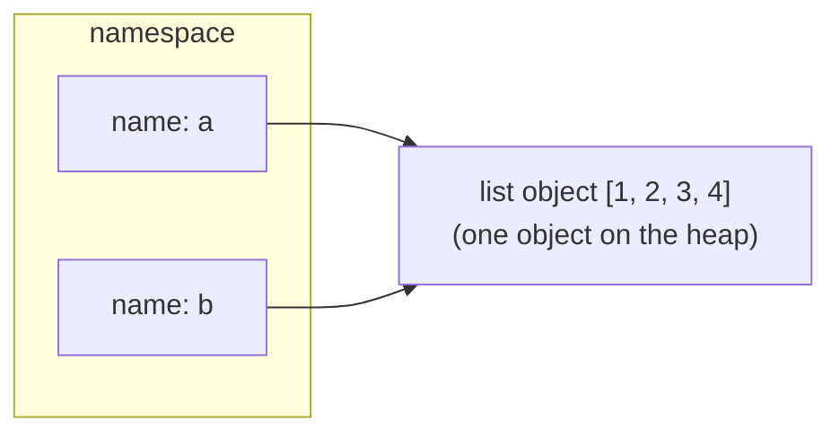

## Learning objectives

- Replace the "variables are boxes" mental model with the correct one: **names bound to objects**.
- Explain identity (`is`, `id()`) vs equality (`==`) and when each is correct.
- Describe reference counting, the cyclic garbage collector, and when objects actually die.
- Explain interning of small ints and strings — and why it must never affect your code's logic.
- Predict the output of tricky aliasing snippets — the bread and butter of Python interviews.

## Prerequisites

[How Python Executes Your Code](/courses/python/python-execution-model). You should know that `LOAD_FAST`/`STORE_FAST` move object references, which is exactly what this lesson explains.

## Names are not boxes

In C, a variable is a named memory location; assignment copies bytes into it. Python is fundamentally different:

> **Every value is an object on the heap. A "variable" is just a name in a namespace that refers to an object. Assignment never copies an object — it makes a name point at one.**

```python
a = [1, 2, 3]
b = a          # b now refers to the SAME list object
b.append(4)
print(a)       # [1, 2, 3, 4]  — "a changed" because there is only one list
```



Three rules cover almost everything:

1. **Assignment binds a name to an object.** `x = y` makes both names refer to one object.
2. **Mutation changes an object; rebinding changes a name.** `lst.append(1)` mutates; `lst = lst + [1]` rebinds `lst` to a *new* list.
3. **Function calls assign arguments.** Python is **call-by-object-reference**: the parameter becomes another name for the caller's object. Mutating it is visible outside; rebinding it is not.

```python
def mutate(items):
    items.append(99)     # visible to the caller — same object

def rebind(items):
    items = items + [99] # invisible — 'items' now names a new local object

data = [1, 2]
mutate(data)   # data == [1, 2, 99]
rebind(data)   # data unchanged
```

## Identity vs equality

- `a == b` asks "do these objects have equal **values**?" (calls `__eq__`).
- `a is b` asks "are these the **same object**?" (compares `id(a) == id(b)`; in CPython `id` is the memory address).

```python
x = [1, 2, 3]
y = [1, 2, 3]
x == y   # True  — equal values
x is y   # False — two distinct objects
z = x
z is x   # True  — one object, two names
```

**The only routine legitimate uses of `is`:** comparing to singletons — `x is None`, `x is True/False` (rarely), sentinel objects (`if arg is _MISSING`), and `type(x) is SomeClass` when you deliberately exclude subclasses.

### Interning — the classic trap

CPython caches small integers (-5 to 256) and many strings, reusing single objects:

```python
a = 256; b = 256
a is b        # True  — cached small int
a = 257; b = 257
a is b        # False in a REPL... but often True in a script
              # (compiler folds equal constants in one code object)
```

This is why `is` on ints/strings is a bug even when it "works on my machine": the behavior is an **implementation detail** that varies by value, by version, and by whether the code was in one compilation unit. Linters flag it (`F632`). Always compare values with `==`.

## Reference counting and the garbage collector

Every CPython object carries a reference count. `sys.getrefcount(x)` shows it (one higher than expected — the call itself holds a temporary reference).

```python
import sys
data = []
sys.getrefcount(data)   # 2 (data + the argument reference)
other = data
sys.getrefcount(data)   # 3
del other
sys.getrefcount(data)   # 2
```

- Binding a name, putting an object in a container, or passing it to a function **increments** the count.
- `del name`, rebinding, or a container being destroyed **decrements** it.
- **The instant the count hits zero, the object is destroyed** — deterministically, immediately. This is why CPython file handles often get closed "by magic" when the last reference dies (still: use `with`; PyPy has no refcounting and won't save you).

`del` deletes **the name**, not the object. The object dies only if that was the last reference.

### Cycles and `gc`

Reference counting can't free cycles (`a.ref = b; b.ref = a` — counts never reach zero). CPython's **cyclic garbage collector** runs periodically, finds unreachable cycles, and frees them. Practical consequences:

- `__del__` on objects in cycles delays their collection and is a well-known foot-gun — avoid finalizer logic; use context managers or `weakref.finalize`.
- Long-lived services with heavy allocation churn sometimes tune `gc` thresholds or disable gen-0 collection during latency-critical windows (Instagram famously ran with GC tweaks). Do this only with measurements.

## Common mistakes

1. **Using `is` for value comparison** (`if status is "active"`). Works by accident until it doesn't. Use `==`.
2. **Believing `b = a` copies.** It aliases. If you need an independent list: `b = a.copy()` (details in the [next lesson](/courses/python/mutability-and-copies)).
3. **Expecting `del` to free memory.** It unbinds a name. Memory is freed only when the last reference disappears — and even then CPython may keep freed blocks pooled for reuse (see memory notes).
4. **Confusing rebinding with mutation in loops.** `for x in lst: x = x * 2` changes nothing in `lst` — `x` is just rebound each iteration.
5. **Relying on `id()` stability.** `id` is unique only *during an object's lifetime*; freed addresses get reused. `id(x) == id(y)` on two temporaries can be True for two different (already-dead) objects.

## Best practices

- Compare values with `==`; reserve `is` for `None` and sentinels.
- Treat function arguments as borrowed: if you must mutate a caller's container, make that explicit in the function's name and docstring (`extend_inplace`), or better, return a new value.
- Use `weakref` for caches and back-references (parent pointers in trees) so you don't create cycles or keep objects alive accidentally.
- When you need a guaranteed-unique sentinel: `_MISSING = object()` — the canonical pattern for "argument not provided" when `None` is a valid value.

## Performance & memory notes

- Every Python object has a header (refcount + type pointer): a small `int` is 28 bytes; an empty `list` is 56; an empty `dict` is 64 (`sys.getsizeof`). Ten million Python ints cost ~280MB while a NumPy `int64` array costs 80MB — this is *the* reason numeric Python uses NumPy/array-based storage.
- A list of objects stores **pointers**; `getsizeof(lst)` excludes the elements. Deep memory profiling needs `tracemalloc` or `pympler`.
- CPython uses an internal small-object allocator (**pymalloc**) with arenas; freed object memory often stays reserved for Python rather than returning to the OS. A process whose RSS doesn't drop after freeing data is usually normal, not a leak.
- Refcount updates on every bind/unbind are a real cost and historically the core reason removing the GIL was hard (free-threaded 3.13 uses biased refcounting to cope).

## Production tips

- Genuine memory leaks in Python services are usually **unbounded containers holding references** (module-level caches, global lists of handlers) — not GC failures. Hunt them with `tracemalloc` snapshots diffed over time.
- `gc.freeze()` after startup (pre-fork servers like Gunicorn) moves long-lived objects out of GC consideration and improves copy-on-write sharing between workers.
- Beware closures and default arguments capturing large objects — they extend lifetimes invisibly.

## Interview questions

1. **"Is Python pass-by-value or pass-by-reference?"** — Neither in the C++ sense: it's call-by-object-reference (a.k.a. call-by-sharing). The parameter is a new name for the same object; mutation is shared, rebinding is local.
2. **"Difference between `is` and `==`?"** — Identity vs equality; `is` compares object identity, `==` calls `__eq__`. Use `is` only for singletons/sentinels.
3. **"Why does `a = 256; b = 256; a is b` give True but 257 give False?"** — Small-int interning (-5..256); an implementation detail, never to be relied on.
4. **"How does Python manage memory?"** — Reference counting for immediate reclamation + a generational cyclic GC for cycles + pymalloc arenas for small objects.
5. **"What does `del` do?"** — Removes a name binding (or container item), decrementing the refcount; object destruction only occurs at refcount zero.

## Summary

- Variables are **names bound to heap objects**; assignment never copies.
- Mutation is visible through every alias; rebinding affects one name.
- `==` compares values, `is` compares identity; interning makes `is` on ints/strings a trap.
- Objects die at refcount zero; the cyclic GC handles cycles; `del` removes names, not objects.
- Object headers make per-object memory chunky — bulk numeric data belongs in arrays.

## Exercises

**Easy**

1. Predict, then verify: `a = [1]; b = a; a += [2]; print(b)` and then the same with `a = a + [2]`. Explain the difference (`+=` on a list calls `__iadd__` → `extend`, mutating in place).
2. Show with `sys.getrefcount` how putting an object in a dict and removing it changes its count.

**Medium**

3. Write a function `all_aliases(obj, namespace)` that returns every name in a given namespace dict bound to exactly that object (use `is`).
4. Build a parent↔child pair of classes that leak under `gc.disable()`, prove the leak with `gc.collect()` counts, then fix it with `weakref.ref` for the parent pointer.

**Hard**

5. Implement a `Sentinel` class such that `Sentinel("MISSING")` always returns the *same* object per name (a per-name singleton), survives `copy.deepcopy` unchanged, and has a useful `repr`.

**Debugging exercise**

6. This cache "leaks" users even after logout. Explain why and fix it two ways (weakref / explicit eviction):

```python
_seen_users = []

def track(user):
    _seen_users.append(user)   # grows forever; every User stays alive
```

**Refactoring exercise**

7. Refactor this API to stop surprising callers, and explain the aliasing bug: 

```python
def with_defaults(config):
    config.setdefault("retries", 3)   # mutates the caller's dict!
    return config
```

**Mini project**

Write a tiny object-graph inspector: given any object, walk `gc.get_referents` up to depth N and print a tree of `type(obj).__name__`, `id`, and refcount — cycle-safe (track visited ids). Use it to visualize what a closure actually holds alive.

## Quiz

<details>
<summary>1. After <code>x = "hello"; y = x; x = x.upper()</code>, what is <code>y</code>?</summary>
"hello". Strings are immutable — <code>upper()</code> creates a new object and <code>x</code> is rebound to it; <code>y</code> still names the original.
</details>

<details>
<summary>2. When exactly is a CPython object destroyed?</summary>
The moment its reference count reaches zero — immediately and deterministically. Objects in reference cycles are the exception: they wait for the cyclic GC.
</details>

<details>
<summary>3. Why is <code>if name is "admin":</code> a bug even if it passes your test?</summary>
String interning is an implementation detail; two equal strings may or may not be the same object depending on how they were created. Only <code>==</code> is guaranteed correct.
</details>

<details>
<summary>4. What does <code>id(x)</code> guarantee?</summary>
Uniqueness among objects alive at the same time (in CPython it's the address). After an object dies, its id may be reused.
</details>

<details>
<summary>5. Function <code>f(lst)</code> does <code>lst = []</code>. Does the caller's list become empty?</summary>
No — that's rebinding the local name. <code>lst.clear()</code> would empty the caller's object.
</details>

## Further reading

- Ned Batchelder — "Facts and myths about Python names and values" (the classic talk)
- `gc`, `weakref`, `tracemalloc` module docs
- CPython source: `Include/object.h` (the object header)
