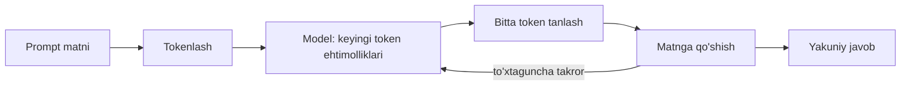

## Bu darsda nimalarni o‘rganamiz

- **Keyingi tokenni bashorat qilish** va nega “u faqat keyingi so‘zni bashorat qiladi” kuchli ekanini.
- **Kontekst oynasi** haqida fikrlash va uni oshirсangiz nima bo‘lishini.
- **Temperature**, top-p va boshqa sampling tugmalari bilan tasodifiylikni boshqarish.
- Modellar *nega* to‘qib chiqarishini va uni kamaytiruvchi amaliy richaglar.

## Oldindan nima bilish kerak

[Zamonaviy AI Manzarasi](/courses/ai-python/modern-ai-landscape). Ehtimollik 0 va 1 orasidagi son ekanidan boshqa matematika kerak emas.

## Asosiy g‘oya — bir jumlada

> LLM — matn berilганда **har mumkin keyingi token uchun ehtimollik** chiqaradigan funksiya. Generatsiya — buni takroran qilish, har safar tanlangan tokenni qo‘shib.

**Hayotiy o‘xshatish — dunyodagi eng zo‘r avto-to‘ldirish.** Telefoningiz klaviaturasi oxirgi bir necha so‘zdan keyingi so‘zni taklif qiladi. LLM ham xuddi shuni qiladi, lekin “oxirgi bir necha so‘z” butun hujjatingiz bo‘lishi mumkin va “keyingi so‘z nima” tuyg‘usi ulkan matndan o‘rganilgan.

## Javob aslida qanday hosil bo‘ladi



Ikki oqibat shu halqadan chiqadi:
- **Generatsiya ketma-ket** — token *n+1* token *n* ga bog‘liq. Shuning uchun kechikish chiqish uzunligi bilan o‘sadi va streaming (keyingi dars) mavjud.
- Model **oldinga qaramaydi** yoki inson ma’nosida rejalashtirmaydi; izchillik har qadam avvalgi hammasiga bog‘langanidan kelib chiqadi.

## Kontekst oynasi

**Kontekst oynasi** — model bir vaqtda hisobga oladigan tokenlarning maksimal soni (prompt **+** javob) — modelning qisqa muddatli xotirasi.

```python
# Taxminiy qoida (inglizcha): 1 token ≈ 4 belgi ≈ 0.75 so'z.
# 128k tokenli oyna ≈ ~300 bet matn.
```

- Model “biladigan” hamma narsa oynaga sig‘ishi kerak: tizim ko‘rsatmalari, suhbat tarixi, olingan hujjatlar va javob.
- **Uni oshirсangiz API xato beradi** (yoki jimgina kesadi). Oynaга nimani solishni boshqarish — asosiy ko‘nikma.
- Kattaroq oyna bepul emas: xarajat tokenlar bilan oshadi va muhim faktlar juda uzun kontekstда ko‘milib qolsa sifat pasayadi.

## Temperature va sampling

`temperature` sampling’dan oldin ehtimolliklarni miqyoslaydi:

| temperature | Ta’siri | Uchun |
|---|---|---|
| `0` | Deterministik: eng ehtimolli tokenni oladi | Ajratish, klassifikatsiya, kod, JSON |
| `0.2–0.5` | Biroz o‘zgaruvchan | Savol-javob, umumlashtirish |
| `0.7–1.0` | Ijodiy, kutilmaganroq | Brainstorming, marketing matni |
| `> 1.2` | Ko‘pincha nomuvofiq | Kamdan-kam foydali |

```python
client.chat(messages, temperature=0)     # deterministik-do'st
client.chat(messages, temperature=0.9)   # ijodiy
```

- **top-p** — ehtimolliklari `p` gача yig‘iladigan eng kichik token to‘plamidan sampling. Temperature *yoki* top-p ni sozlang, ikkalasini agressiv emas.
- **max_tokens** — javob uzunligiga (va xarajatга) qat’iy chegara.
- **stop sequences** — generatsiyani to‘xtatuvchi qatorlar.

> [!NOTE]
> `temperature=0` da ham chiqishlar bayt-bayt bir xil kafolatlanmaydi — suzuvchi nuqta va provayder tomonidagi batching kichik nodeterminizm keltiradi. Testlarni aniq matn emas, *shakl* bo‘yicha tuzing.

## Nega modellar to‘qib chiqaradi

Hallucination — ishonchli, ravon, **noto‘g‘ri** bayonot. U mexanizmdan to‘g‘ridan-to‘g‘ri kelib chiqadi: model *ishonarli keyingi tokenlar*ni optimallashtiradi, *rost*ni emas.

Kamaytiruvchi richaglar:
1. **Faktlarni bering** (retrieval / RAG) — o‘qitish xotirasiga tayanmang.
2. **Iqtibos so‘rang** va iqtibossiz javobni rad eting.
3. **Faktik vazifalar uchun temperature’ni pasaytiring.**
4. **“Bilmayman” deyishга ruxsat bering** — tizim promptda rad etishni aniq ruxsat eting.
5. **Asboblar bilan tekshiring** — kalkulyator yoki bazani chaqirsin, boshda hisoblamasin.

## Xulosa

- LLM keyingi tokenni qayta-qayta bashorat qiladi; shu bitta mexanizm barcha xatti-harakatini hosil qiladi.
- Kontekst oynasi — ko‘rsatmalar, tarix, olingan hujjatlar va javob bo‘lishadigan cheklangan qisqa xotira.
- Temperature/top-p determinizmni ijodkorlik bilan almashtiradi — vazifaga qarab tanlang.
- Hallucination “ishonarli matn bashorat qilish”ga xos; modelni faktlar, iqtiboslar va asboblar bilan yerga bog‘lang.

## Mashqlar

**Oson**

1. 1200 so‘zli hujjatning token sonini 0.75-so‘z-per-token qoidasi bilan taxmin qiling. U 4k oynaga 500-tokenlik javob bilan sig‘adimi?
2. Quyidagilar uchun temperature tanlang: invoice summasini ajratish, tug‘ilgan kun she’ri yozish, qo‘llab-quvvatlash chiptalarини klassifikatsiya.

**O‘rtacha**

3. Har qanday provayderni `temperature=0` da ikki marta va `temperature=1` da ikki marta bir xil prompt bilan chaqiring. Farqni tasvirlang.
4. So‘rov oynaga sig‘adimi (xavfsizlik chegarasi bilan) qaytaradigan `will_fit(prompt_tokens, max_answer, window)` yozing.

**Advanced**

5. Umumlashtiruvchi uzun kirishda xatosiz kesilgan chiqish beradi. Uch sababni (oyna to‘lishi, `max_tokens` chegarasi, klient kesishi) va har birini qanday tasdiqlashni sanang.

**Mini loyiha**

Tizim prompt, chat tarixi va maqsad javob uzunligini olib, tanlangan oynada qancha token qolganini xabar qiladigan `token_budget.py` quring.

## Test

<details>
<summary>1. Model butun jumlani yozishdan oldin rejalashtiradimi?</summary>
Yo‘q — u bir vaqtda bitta token hosil qiladi, har biri avvalgi hammasiga bog‘lanadi. Izchillik emergent.
</details>

<details>
<summary>2. Kontekst oynasini javobdan tashqari yana nima bo‘lishadi?</summary>
Tizim ko‘rsatmalari, suhbat tarixi va olingan hujjatlar — hammasi bir token byudjeti uchun raqobatlashadi.
</details>

<details>
<summary>3. Ishonchli JSON ajratish uchun qaysi temperature?</summary>
0 ga yaqin — eng ehtimolli, eng izchil tokenlar.
</details>

<details>
<summary>4. Hallucination’ni kamaytirishning ikki usulini ayting.</summary>
Retrieval orqali faktlar berish va iqtibos talab qilish; shuningdek temperature’ni pasaytirish, “bilmayman”ga ruxsat va asboblar bilan tekshirish.
</details>

## Keyingi dars

[Tokenlar, Embeddinglar va Vektor Fazosi](/courses/ai-python/tokens-and-embeddings).
