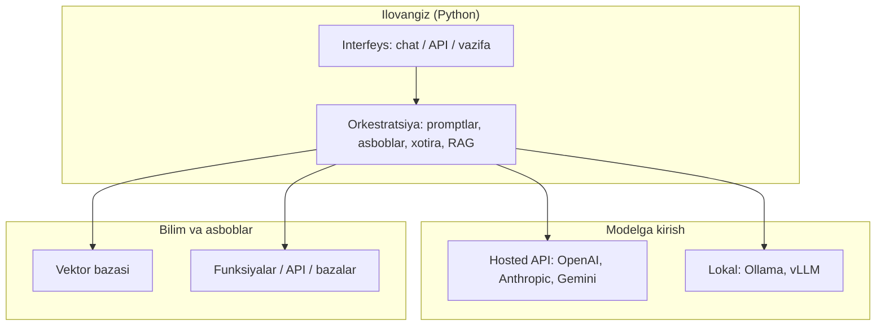

## Bu darsda nimalarni o‘rganamiz

- **AI muhandisi** nima quradi va bu ML muhandisi yoki data-scientistdan qanday farq qiladi.
- Zamonaviy AI ekotizimi: modellar, provayderlar, hosting va asboblar qatlami.
- LLM ilovasining uchma-uch anatomiyasi.
- Berilgan muammo uchun hosted API va lokal model orasida oqilona tanlash.

## Oldindan nima bilish kerak

O‘rta darajadagi Python (funksiyalar, klasslar, `async` asoslari, `pip`/virtualenv). ML bo‘yicha bilim **shart emas** — bu kurs modelni siz chaqiradigan komponent deb qaraydi, o‘qitadigan narsa emas.

## Asosiy g‘oya — bir jumlada

> **AI muhandisi** oldindan o‘qitilgan modellar *atrofida* dasturiy ta’minot quradi — u LLM’ni mahsulotга retrieval, asboblar, xotira va cheklovlar bilan ulaydi. U modelni noldan o‘qitmaydi.

**Hayotiy o‘xshatish — juda qobiliyatli, lekin unutuvchan pudratchi.** LLM til vazifalarida ajoyib, lekin biznesingiz xotirasi yo‘q, bazangizga kirmagan va to‘g‘ri kontekst bermasangiz ishonch bilan to‘qib chiqaradi. Sizning ishingiz — o‘sha pudratchi atrofidagi hamma narsa: to‘g‘ri hujjatlarni berish, asboblar ishlatishга ruxsat berish, ishini tekshirish va byudjetда tutish.

## AI muhandisi vs ML muhandisi vs data-scientist

| Rol | Egallaydi | Asboblar | Model o‘qitadimi? |
|---|---|---|---|
| Data-scientist | Ma’lumotdan xulosa | pandas, notebook, statistika | Ba’zan (kichik) |
| ML muhandisi | Model o‘qitish va xizmat | PyTorch, TensorFlow, GPU | Ha |
| **AI muhandisi** | **Modellar ustiga qurilgan mahsulot** | **LLM API, vektor baza, orkestratsiya** | **Yo‘q — mavjudini chaqiradi** |

Kuchli umumiy modellarning (GPT, Claude, Gemini, Llama) paydo bo‘lishi qiymatning ko‘p qismini *o‘qitish*dan *integratsiya*ga ko‘chirdi. O‘sha integratsiya qatlami — bu butun kurs.

## Ekotizim, qatlamma-qatlam



- **Modelga kirish** — hosted API (tez boshlash, token bo‘yicha to‘lov) yoki lokal runtime (maxfiy, qat’iy narx).
- **Orkestratsiya** — *siz* shu yerdasiz: promptlarni yig‘ish, asboblar chaqirish, kontekst olish.
- **Bilim va asboblar** — maxfiy hujjatlar uchun vektor bazasi va modelга dunyoga ta’sir qiladigan funksiyalar.

## LLM ilovasi anatomiyasi

Ishlab chiqarish funksiyasi kamdan-kam “modelni chaqir, matnni qaytar”. U quvur:

```python
def answer(question: str) -> str:
    context = retrieve(question)            # RAG: mos maxfiy hujjatlarni ol
    messages = build_prompt(question, context)  # prompt muhandisligi
    reply = llm.chat(messages, tools=TOOLS)      # provayder API + tool calling
    if reply.tool_calls:                    # agent halqasi
        results = run_tools(reply.tool_calls)
        reply = llm.chat(messages + results)
    validate(reply)                         # strukturaviy chiqish / cheklovlar
    log_cost(reply.usage)                   # xarajat va kuzatuv
    return reply.text
```

Yuqoridagi har qator — siz o‘zlashtiradigan mavzu. Bu skeletni yodda tuting.

## Hosted API vs lokal — qachon qaysi

| Omil | Hosted API | Lokal (Ollama/vLLM) |
|---|---|---|
| Birinchi chaqiruvga vaqt | Daqiqalar | Soatlar (sozlash, GPU) |
| Sifat cho‘qqisi | Eng yuqori | Yaxshi, cho‘qqidan past |
| Xarajat modeli | Token bo‘yicha | Qat’iy apparat |
| Ma’lumot maxfiyligi | Tarmog‘ingizdan chiqadi | Mashinangizda qoladi |
| Uchun eng yaxshi | Ko‘p mahsulot, prototip | Maxfiy ma’lumot, katta hajm, oflayn |

**LLM umuman qachon KERAK EMAS:** aniq arifmetika, deterministik biznes qoidalari — regex yoki SQL ishonchli yechadigan har narsa. Bir to‘g‘ri, tekshiriladigan javobli muammolar uchun LLM noto‘g‘ri vosita.

## Keng tarqalgan noto‘g‘ri tushunchalar

1. **“AI muhandisligi = model o‘qitish.”** — Deyarli hech qachon. Siz oldindan o‘qitilgan modellarni integratsiya qilasiz.
2. **“Kattaroq model = doim yaxshiroq.”** — Kattaroq qimmatroq va sekinroq; yaxshi retrieval’li kichik model ko‘pincha yutadi.
3. **“Model mening ma’lumotimni biladi.”** — U o‘qitish kesimidan keyingi va maxfiy hech narsani bilmaydi. Retrieval buni tuzatadi.

## Xulosa

- AI muhandisligi — **integratsiya**, o‘qitish emas: qobiliyatli oldindan o‘qitilgan modellar atrofida dastur qurasiz.
- Stek to‘rt qatlam — interfeys, orkestratsiya, modelga kirish, bilim/asboblar.
- Real funksiya — quvur: ol → prompt → chaqir → asboblarni ishlat → tekshir → o‘lcha.
- Hosted vs lokalni maxfiylik, hajm va sifat bo‘yicha tanlang; LLM qachon noto‘g‘ri vosita ekanini biling.

## Mashqlar

**Oson**

1. Ishlatadigan ilovalaringizdan LLM quvvatlaydigan uch funksiyani va AI’ga o‘xshaydigan, lekin oddiy kod bo‘lgan bittasini yozing.
2. “Emaillarimni umumlashtir” funksiyasi uchun har talab qaysi qatlamга tegishini belgilang.

**O‘rtacha**

3. Bemor yozuvlarini o‘qiydigan shifoxona chatboti uchun hosted vs lokal tanlovi bo‘yicha bir paragraf memo yozing.
4. `answer()` skeletini olib, har qatorni uni amalga oshiruvchi dars bilan izohlang.

**Advanced**

5. Kompaniya hujjatlarini iqtibos qilishi, odamga eskalatsiya qilishi va boshqa mijoz ma’lumotini oshkor qilmasligi kerak bo‘lgan qo‘llab-quvvatlash yordamchisi uchun komponent diagrammasini loyihalang.

**Mini loyiha**

4–5 modelni (nom, provayder, hosted/lokal, taxminiy narx, eng yaxshi ishlatish) chop etadigan `landscape.py` yozing.

## Test

<details>
<summary>1. AI muhandisi odatda model o‘qitadimi?</summary>
Yo‘q — ular oldindan o‘qitilgan modellar atrofida ilova quradi. O‘qitish — ML masalasi.
</details>

<details>
<summary>2. “Orkestratsiya” stekда qayerda?</summary>
Interfeys va model orasida — promptlarni yig‘adi, asboblar chaqiradi, kontekst oladi, tuzilma majburlaydi.
</details>

<details>
<summary>3. Lokal modelni tanlashning bir sababini ayting.</summary>
Ma’lumot maxfiyligi (ma’lumot tarmoqdan chiqmaydi), katta hajm yoki oflayn ishlash.
</details>

<details>
<summary>4. Nega retrieval deyarli har jiddiy LLM ilovasining qismi?</summary>
Model maxfiy yoki o‘qitish-keyingi ma’lumotni bilmaydi; retrieval o‘sha kontekstni so‘rov vaqtida qo‘shadi.
</details>

## Keyingi dars

[LLM’lar Aslida Qanday Ishlaydi](/courses/ai-python/llm-fundamentals).
