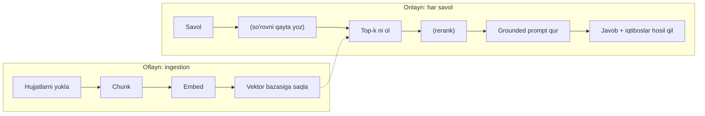

## Bu darsda nimalarni o‘rganamiz

- To‘liq **RAG** quvurini va nega har bosqich borligini.
- *Sodda* RAG nega noto‘g‘ri yoki asossiz javob berishini.
- Reranking, gibrid qidiruv va so‘rovni qayta yozish bilan retrieval’ni yaxshilash.
- **Grounding**ni majburlash: iqtibosli yoki rad etadigan javoblar.

## Oldindan nima bilish kerak

[Vektor Bazalari](/courses/ai-python/vector-databases) va [Prompt Muhandisligi](/courses/ai-python/prompt-engineering).

## Asosiy g‘oya — bir jumlada

> **RAG** = so‘rov vaqtида mos matnni olib promptga qo‘yish, shunda model *sizning* faktlaringizdan javob beradi, muzlagan xotirasidan emas.

**Hayotiy o‘xshatish — ochiq-kitob vs yopiq-kitob imtihoni.** Xom LLM yopiq-kitob imtihonini xotiradan topshiradi: tez, lekin noto‘g‘ri eslaydi va to‘qiydi. RAG unga kitobни to‘g‘ri betда ochib beradi va “shundan foydalanib javob ber” deydi. Bir xil talaba, ancha kam noto‘g‘ri javob — va qaysi betdan foydalanganini tekshira olasiz.

## Quvur



## Sodda RAG va nega u ko‘ngil qoldiradi

```python
def naive_rag(question):
    chunks = retrieve(question, k=4)
    context = "\n\n".join(chunks)
    messages = [
        {"role": "system", "content": "Savolга javob ber."},
        {"role": "user", "content": f"{context}\n\nSavol: {question}"},
    ]
    return llm.chat(messages)
```

Bu *demolarда ishlaydi*, lekin ishlab chiqarishда buziladi, chunki:
- **Prompt grounding’ni majburlamaydi** — model kontekstni e’tiborsiz qoldirib xotiradan javob berishi mumkin.
- **Iqtiboslar yo‘q** — tekshirib bo‘lmaydi.
- **“Bilmayman” yo‘li yo‘q** — mos kelmaydigan kontekst ham ishonchli javob beradi.
- Retrieval **bir martalik**.

## Ishlab chiqarish darajasidagi RAG

```python
SYSTEM = """Sen qo'llab-quvvatlash yordamchisisan. FAQAT quyidagi raqamlangan manbalardan javob ber.
- Manbalarни [1], [2] kabi iqtibos qil.
- Agar manbalar javobни o'z ichiga olmasa, "Menda bu ma'lumot yo'q" de.
- Tashqi bilim ishlatma."""

def rag(question):
    candidates = retrieve(question, k=12)          # ortiqcha ol
    top = rerank(question, candidates)[:4]         # chindan mos bo'lganlarни sakla
    sources = "\n".join(f"[{i+1}] {c}" for i, c in enumerate(top))
    messages = [
        {"role": "system", "content": SYSTEM},
        {"role": "user", "content": f"Manbalar:\n{sources}\n\nSavol: {question}"},
    ]
    return llm.chat(messages, temperature=0)        # faktik → past temperature
```

Tuzatishlar:
- **Ortiqcha olib, keyin rerank** — ko‘p nomzod ol, keyin cross-encoder/reranker bilan chindan javob beradiganlarни sakla.
- **Raqamlangan manbalar + iqtiboslar** — javoblarни tekshiriladigan qiladi.
- **Aniq rad etish bandi** — “ishonch bilan noto‘g‘ri” ni “halol noaniq” ga aylantiradi.
- **temperature=0** — faktik javob.

## Richag beradigan usullar

| Usul | Yechadigan muammo |
|---|---|
| **Reranking** | Embedding top-k da yaqin-o‘tishlar |
| **Gibrid qidiruv** | Embedding o‘tkazib yuboradigan aniq ID/kodlar |
| **So‘rovni qayta yozish** | Noaniq savollar |
| **Metadata filtr** | Noto‘g‘ri tenant/sana |

Hammasini birinchi kunда kerak emas. Baholash muayyan xatoni ko‘rsatганда qo‘shing.

## RAG’ni baholang — ko‘z bilan emas

RAG’ning ikki xato yuzasi bor; ikkalasini o‘lchang:
- **Retrieval sifati** — to‘g‘ri bo‘lak top-k ga tushdimi? (recall@k)
- **Javob sifati** — yakuniy javob to‘g‘ri va olinganga asoslanganmi? (faithfulness)

```python
cases = [("Parolimni qanday tiklayman?", "handbook-pw-0")]
hits = sum(expected in [id_of(c) for c in retrieve(q, k=5)] for q, expected in cases)
print(f"recall@5 = {hits/len(cases):.0%}")
```

## Keng tarqalgan xatolar

1. **Grounding ko‘rsatmasi yo‘q** — RAG’ning butun mohiyati o‘tkazib yuborilgan.
2. **k juda kichik** — javob bo‘lagi umuman olinmaydi.
3. **Xom bo‘laklarни tuzilmasiz tashlash** — ularni raqamlang.
4. **“Javob yo‘q” holatini e’tiborsiz qoldirish** — doim rad etishга ruxsat.
5. **Retrieval’ni alohida o‘lchamaslik** — ajratmagan narsani tuzata olmaysiz.

## Xulosa

- RAG so‘rov vaqtида mos matnни kiritadi, shunda model faktlaringizdan javob beradi.
- Ingestion (yukla/chunk/embed/saqla) oflayn; retrieval+generatsiya onlayn.
- Sodda RAG grounding, iqtibos, rad etish va rerankingsiz buziladi.
- Retrieval va javob sifatini alohida o‘lchang.

## Mashqlar

**Oson**

1. `naive_rag` funksiyasiga uch grounding tuzatishini qo‘shing.
2. Bazangiz javob bera olmaydigan savol bering. Yaxshilangan tizim to‘qib chiqarish o‘rniga rad etishini tekshiring.

**O‘rtacha**

3. Ortiqcha olib, oddiy reranker (nomzodlarни so‘rov bilan kalit so‘z o‘xshashligiга qayta ballash) qo‘llang.
4. Qisqa savolни kengaytiruvchi so‘rov-qayta-yozish bosqichini qo‘shing.

**Advanced**

5. 500k bo‘lakли, 50 mijozли docs sayti uchun RAG loyihalang: izolyatsiya, yangilik, xarajat nazorati.

**Mini loyiha**

Papkaга yo‘naltirilib, uni ingest qilib (chunk/embed/saqla), keyin terminaldан savollarга `[n]` iqtiboslari va rad etish yo‘li bilan javob beradigan `rag_cli.py` quring. `--eval` rejimini ham qo‘shing.

## Test

<details>
<summary>1. RAG’ning ikki bosqichi?</summary>
Oflayn ingestion (yukla, chunk, embed, saqla) va onlayn so‘rov (ol, ixtiyoriy rerank, hosil qil).
</details>

<details>
<summary>2. Nega ortiqcha olib, keyin rerank?</summary>
Embedding o‘xshashligi qo‘pol; ortiqcha olish recall’ni oshiradi, reranking faqat chindan mos bo‘laklarни saqlab aniqlikni tiklaydi.
</details>

<details>
<summary>3. Hallucination’ni eng ko‘p kamaytiruvchi bitta ko‘rsatma?</summary>
"Faqat berilgan manbalardan javob ber va ular javobни o'z ichiga olmasa, bilmayman de."
</details>

<details>
<summary>4. Nega retrieval va generatsiya alohida baholanadi?</summary>
Noto‘g‘ri javob retrieval o‘tkazib yuborishi yoki generatsiya xatosi bo‘lishi mumkin; ularni ajratish nimani tuzatishni aytadi.
</details>

## Keyingi dars

[Prompt Muhandisligi](/courses/ai-python/prompt-engineering).
