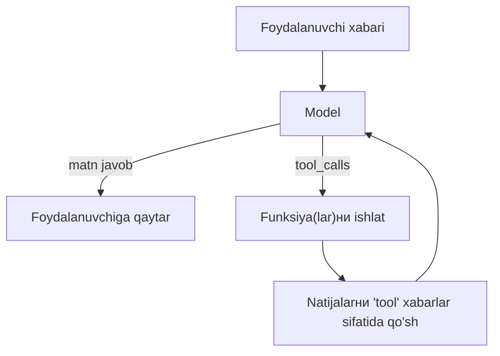

## Bu darsda nimalarni o‘rganamiz

- Pydantic bilan modelni **yaroqli JSON** qaytarishга majburlash.
- **Function/tool calling**ni tushunish: modelга Python’ingizni chaqirtirish.
- Chat modelini avtomatlashtirishga aylantiruvchi **tool-use halqasi**ni qurish.
- Validatsiya, xatolar va strukturaviy chiqish vs asboblar farqi.

## Oldindan nima bilish kerak

[Prompt Muhandisligi](/courses/ai-python/prompt-engineering) va Python typing / Pydantic asoslari.

## Asosiy g‘oya — bir jumlada

> **Strukturaviy chiqish** modelга siz aniqlagan blankani to‘ldirtiradi; **tool calling** modelга *sizning kodingiz*dan biror ishни so‘rashга va natijani ishlatishга imkon beradi.

**Hayotiy o‘xshatish — blanka vs telefon.** Strukturaviy chiqish — modelга yorliqli maydonli blanka berib, har bo‘shliqni to‘g‘ri to‘ldirishни talab qilish. Tool calling — modelга telefon berish: o‘zi qila olmaydigan fakt yoki amal (bugungi ob-havo, bazaга yozish) kerak bo‘lganда, siz ro‘yxatga olgan funksiyani “chaqiradi” va davom etishдан oldin javobни kutadi.

## Pydantic bilan strukturaviy chiqish

```python
from pydantic import BaseModel, Field

class Invoice(BaseModel):
    vendor: str
    total: float = Field(description="Umumiy summa USD'da")
    due_date: str  # ISO sana
    line_items: list[str]

# Ko'p SDK sxemani to'g'ridan-to'g'ri qabul qiladi va mos JSON kafolatlaydi:
resp = client.responses.parse(
    model="gpt-4o-mini",
    input=f"Invoice maydonlarini ajrat:\n{raw_text}",
    text_format=Invoice,          # provayder chiqishни shunga qarshi tekshiradi
)
invoice: Invoice = resp.output_parsed   # allaqachon tipli va tekshirilgan
```

Provayder/SDK sxema-majburlashни qo‘llab-quvvatlamasa, qo‘lда qiling va *tekshiring*:

```python
raw = client.chat(messages + [{"role": "system",
      "content": f"FAQAT shu sxemaga mos JSON qaytar: {Invoice.model_json_schema()}"}])
invoice = Invoice.model_validate_json(raw)   # yomon ma'lumotда xato — ushlab retry
```

Qoida: **xom model JSON’ига hech qachon ishonmang; doim sxema bilan tekshiring.**

## Tool (function) calling

Siz funksiyalarni tasvirlaysiz; model qachon va qanday argument bilan chaqirishni hal qiladi; siz bajarib natijani qaytarasiz.

```python
def get_weather(city: str) -> str:
    return f"{city}: 22°C, ochiq"      # real impl API chaqiradi

tools = [{
    "type": "function",
    "function": {
        "name": "get_weather",
        "description": "Shahar uchun joriy ob-havoни oladi.",
        "parameters": {
            "type": "object",
            "properties": {"city": {"type": "string"}},
            "required": ["city"],
        },
    },
}]
```

Model funksiyangizni **ishlatmaydi** — u chaqirish *so‘rovi*ni qaytaradi. Siz ishlatib chiqishни qaytarasiz.

## Tool-use halqasi



```python
def run(question):
    messages = [{"role": "user", "content": question}]
    while True:
        reply = client.chat(messages, tools=tools)
        if not reply.tool_calls:
            return reply.content                 # model tugadi
        messages.append(reply.message)
        for call in reply.tool_calls:
            args = json.loads(call.function.arguments)
            result = REGISTRY[call.function.name](**args)   # bajarish
            messages.append({"role": "tool", "tool_call_id": call.id,
                             "content": str(result)})
```

Bu halqa har “agent”ning yuragi (keyingi dars).

## Strukturaviy chiqish vs asboblar — qaysi qachon

| Xohlaysiz | Ishlating |
|---|---|
| Ma’lum shaklga ajratish/tasniflash | **Strukturaviy chiqish** |
| Jonli ma’lumot olish yoki amal bajarish | **Tool calling** |
| N handlerдан biriга yo‘naltirish | Tool calling yoki enum |

## Keng tarqalgan xatolar

1. **JSON’ni regex/`eval` bilan tahlil qilish** — sxema validatoridан foydalaning; `eval` — xavfsizlik teshigi.
2. **Validatsiya xatosidа retry yo‘q** — modellar ba’zan buzuq JSON chiqaradi.
3. **Tool argumentlarини tekshirmasdan bajarish** — model argumentlarни to‘qishi mumkin.
4. **Noaniq tool tavsiflari** — model noto‘g‘ri tool chaqiradi.
5. **Chegaralanmagan tool halqasi** — cheksiz chaqiruv (va xarajat)dan qochish uchun iteratsiyalarни chegaralang.

## Xavfsizlik eslatmasi

Tool calling model real amallarni ishga tushirishi mumkin degani. Tool argumentlarини **ishonchsiz kirish** deb qarang: tiplarни tekshiring, ruxsat etilgan amallarni oq ro‘yxatга oling va model bergan satrlardан ixtiyoriy shell/SQL ishlatmang.

## Xulosa

- Strukturaviy chiqish modelга tipli blanka to‘ldirtiradi; har safar tekshiring.
- Tool calling modelга kodingizни ishga tushirishни so‘rashга imkon beradi; siz bajarib qaytarasiz.
- Tool-use halqasi (chaqir → asboblarni ishlat → qaytar → takror) agentlar asosi.
- Model bergan JSON va tool argumentlarини ishonchsiz deb bilib, tekshiring va chegaralang.

## Mashqlar

**Oson**

1. `Person(name, age, email)` Pydantic modelini aniqlab, uni chalkash jumladан ajrating; `ValidationError` ni boshqaring.
2. `get_time(timezone)` tool va uning JSON sxemasini yozing.

**O‘rtacha**

3. Ikki tool bilan tool-use halqasini `max_iterations` chegarasi bilan amalga oshiring.
4. Retry qo‘shing: strukturaviy chiqish tekshiruvi muvaffaqiyatsiz bo‘lsa, modelга xato bilan qayta so‘rang.

**Advanced**

5. Buyurtmani qidiradigan (tool) va tipli `OrderStatus` strukturaviy chiqish qaytaradigan mini “yordamchi” quring.

**Mini loyiha**

Tool qo‘shish shunchaki funksiyani dekoratsiya qilish bo‘lgan registrga asoslangan tool-calling halqasi `tools_agent.py` quring. Argument tekshiruvi, iteratsiya chegarasi va har chaqiruv logi bilan.

## Test

<details>
<summary>1. Model JSON’ini `eval()` qilsa bo‘ladimi?</summary>
Hech qachon — bu masofaviy kod bajarish xavfi. `json` bilan tahlil qilib, sxema bilan tekshiring.
</details>

<details>
<summary>2. Model tool chaqiruvi uchun nima qaytaradi?</summary>
Strukturaviy so‘rov (funksiya nomi + argumentlar) — bajarilgan natija emas. Siz ishlatasiz.
</details>

<details>
<summary>3. Tool-use halqasini nima to‘xtatadi?</summary>
tool_calls yo‘q model javobi (yakuniy matn) — yoki iteratsiya chegarangiz.
</details>

<details>
<summary>4. Nega tool argumentlarини tekshirasiz?</summary>
Model real yon ta’sirlarni ishga tushiradigan yomon argumentlarni to‘qishi yoki manipulyatsiya qilinishi mumkin.
</details>

## Keyingi dars

[OpenAI, Anthropic va Gemini API’lari](/courses/ai-python/provider-apis).
