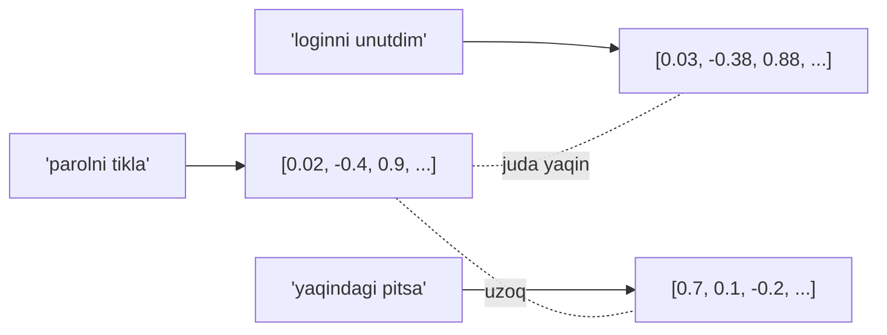

## Bu darsda nimalarni o‘rganamiz

- **Tokenlar** nima va nega ular xarajat, limit va kechikishni belgilaydi.
- **Embedding** nima va matn qanday vektorga aylanadi.
- **Kosinus o‘xshashlik** bilan semantik yaqinlikni o‘lchash.
- Noldan kichik semantik qidiruv qurish — RAG urug‘i.

## Oldindan nima bilish kerak

[LLM’lar Aslida Qanday Ishlaydi](/courses/ai-python/llm-fundamentals). Oddiy Python ro‘yxatlari.

## 1-qism — Tokenlar

### Asosiy g‘oya

Modellar belgilar yoki so‘zlarni emas, **tokenlarni** ko‘radi: qat’iy lug‘atdan so‘z-osti bo‘laklari. `"tokenization"` `token` + `ization` ga bo‘linishi mumkin.

**Hayotiy o‘xshatish — LEGO g‘ishtlari.** Modelning qat’iy g‘ishtlar qutisi bor (lug‘at, ~100k–200k bo‘lak). Har qanday matn shu g‘ishtlardan quriladi. Har to‘lov va har limit harflar emas, g‘ishtlarда hisoblanadi.

```python
import tiktoken
enc = tiktoken.get_encoding("cl100k_base")
ids = enc.encode("AI engineering is fun!")
print(len(ids), ids)          # masalan 6 token
```

### Nega tokenlar muhim

- **Xarajat** token bo‘yicha (kirish va chiqish). “Promptni qisqartir” — “kamroq token ishlat” degani.
- **Kontekst oynasi** so‘zlarда emas, tokenlarда o‘lchanadi.
- **Qoida (inglizcha):** 1 token ≈ 4 belgi ≈ 0.75 so‘z. Kod, JSON va noingliz matn *kamroq* samarali tokenlanadi.
- **Noingliz jarima:** ko‘p tokenizatorlar o‘zbekcha yoki xitoycha matn uchun ingliz tilidan ko‘proq token ishlatadi — real xarajat va kechikish omili.

## 2-qism — Embeddinglar

### Asosiy g‘oya

**Embedding** — matnning *ma’nosini* ifodalovchi sonlar ro‘yxati (vektor, masalan 1536 o‘lchov). Ma’nosi o‘xshash matnlar bir xil yo‘nalishga qaragan vektorlar oladi — hatto umumiy so‘z bo‘lmasa ham.

**Hayotiy o‘xshatish — ma’no xaritasi.** Har iborani ulkan xaritaga qadalgan igna deb tasavvur qiling. “Parolimni tiklayman” va “loginimni unutdim” bir-biriga yaqin joylashadi, “eng yaxshi pitsa”dan uzoq. Embedding — o‘sha ignalarning koordinatalari.



### Embedding hosil qilish

```python
from openai import OpenAI
client = OpenAI()

def embed(text: str) -> list[float]:
    resp = client.embeddings.create(model="text-embedding-3-small", input=text)
    return resp.data[0].embedding   # masalan uzunligi 1536
```

Embeddinglar chat modelidan *boshqa, arzonroq* modeldan keladi. Ularni bir marta hisoblab saqlaysiz (vektor bazasi shuni qiladi — keyingi dars).

### Kosinus o‘xshashlik

Ikki vektor orasidagi **burchak** kichik bo‘lganda “o‘xshash”. Kosinus o‘xshashlik buni `[-1, 1]` oralig‘idagi son sifatida beradi (1 = bir xil yo‘nalish).

```python
import math
def cosine(a, b):
    dot = sum(x*y for x, y in zip(a, b))
    na = math.sqrt(sum(x*x for x in a))
    nb = math.sqrt(sum(y*y for y in b))
    return dot / (na * nb)
```

Nega kosinus? U vektor uzunligini e’tiborsiz qoldirib *yo‘nalishni* (ma’noni) solishtiradi va ko‘p vektor bazasi standart metrikasi.

### Kichik semantik qidiruv — mini RAG

```python
docs = [
    "Parolni tiklash uchun login sahifasida 'Parolni unutdingizmi' ni bosing.",
    "Ish vaqti: dushanbadan jumagacha 9:00–17:00.",
    "To'lovlar 5 ish kunida qайta hisoblanadi.",
]
doc_vecs = [embed(d) for d in docs]

def search(query, k=1):
    q = embed(query)
    ranked = sorted(docs, key=lambda d: cosine(q, doc_vecs[docs.index(d)]), reverse=True)
    return ranked[:k]

search("kira olmayapman")   # → parol-tiklash hujjati, umumiy so'z bo'lmasa ham
```

Bu — retrieval g‘oyasining o‘zi: bilimingizni embed qiling, savolni embed qiling, eng yaqin bo‘laklarni qaytaring.

## Solishtirish — kalit so‘z vs semantik

| | Kalit so‘z (BM25) | Semantik (embedding) |
|---|---|---|
| Mos keladi | Aniq so‘zlar | Ma’no |
| Sinonim/xatolar | Yomon | Yaxshi |
| Xarajat | Arzon | Embedding chaqiruvi |
| Ishlab chiqarishда | **Gibrid: ikkalasi** | **Gibrid: ikkalasi** |

## Keng tarqalgan xatolar

1. **Embedding modellarini aralashtirish** — turli modellardan vektorlar solishtirilmaydi.
2. **Ulkan bloklarни embed qilish** — 50 betlik PDF uchun bitta vektor detalni yo‘qotadi. Avval chunk qiling.
3. **Qayta embed qilish xarajatini e’tiborsiz qoldirish** — agressiv keshlang.

## Xulosa

- Tokenlar — LLM valyutasi: xarajat, kontekst va kechikish ularda o‘lchanadi.
- Embeddinglar matnni masofa ≈ ma’no farqi bo‘lgan vektorlarga aylantiradi.
- Kosinus o‘xshashlik ikki ma’noning yaqinligini o‘lchaydi.
- Hujjatlarni bir marta embed qiling, savolni embed qiling, eng yaqin bo‘laklarni qaytaring — bu retrieval, RAG poydevori.

## Mashqlar

**Oson**

1. Bir jumlaning token sonini inglizcha va boshqa tilда solishtiring. Farqni yozing.
2. `[1,0]` vs `[0,1]` va `[1,1]` vs `[2,2]` uchun kosinus o‘xshashlikni qo‘lда hisoblang. Natijalar nimani anglatadi?

**O‘rtacha**

3. `search()` misolini top-k ni ballari bilan qaytaradigan qilib kengaytiring.
4. Kalit so‘z filtri qo‘shing: faqat kerakli so‘z bo‘lgan hujjatlarни ko‘rib, qolganini semantik tartiblang.

**Advanced**

5. 100k bo‘lak berilганda chiziqli qidiruv juda sekin. Taxminiy indeks buni qanday tezlashtirishini va aniqlik murosasini so‘z bilan tasvirlang.

**Mini loyiha**

`.txt` fayllar papkasini yuklab, har birini embed qilib, terminaldан savollarга eng mos faylni va ballni chop etadigan `mini_search.py` quring. Embeddinglarni diskка keshlang.

## Test

<details>
<summary>1. Tokenlar so‘zlar bilan bir xilmi?</summary>
Yo‘q — ular so‘z-osti bo‘laklari. Keng tarqalgan so‘z bitta token bo‘lishi mumkin; kamyob so‘z bir nechtaga bo‘linadi.
</details>

<details>
<summary>2. Embedding nimani ifodalaydi?</summary>
Matn ma’nosini vektor sifatida; o‘xshash ma’nolar → o‘xshash vektorlar.
</details>

<details>
<summary>3. Ikki turli modeldan embeddinglarni solishtirsa bo‘ladimi?</summary>
Yo‘q — turli modellar mos kelmaydigan vektor fazolarini beradi. Bitta modelni izchil ishlating.
</details>

<details>
<summary>4. Nega hujjatlarni embed qilishdan oldin chunk qilinadi?</summary>
Ulkan hujjatning bitta vektori ma’noni xiralashtiradi; kichik bo‘laklar aniq, olinadigan birliklar beradi.
</details>

## Keyingi dars

[Vektor Bazalari](/courses/ai-python/vector-databases).
