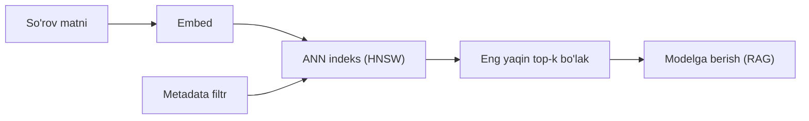

## Bu darsda nimalarni o‘rganamiz

- **Vektor bazasi** chiziqli qidiruvdan farqli nima qilishini.
- Taxminiy indekslar (**HNSW**, IVF) ni intuitiv tushunish.
- Yaxshi **chunking** va **metadata** strategiyasini.
- Chroma bilan vektorlarni saqlash va so‘rash; pgvector/Qdrant/Pinecone solishtiruvi.

## Oldindan nima bilish kerak

[Tokenlar, Embeddinglar va Vektor Fazosi](/courses/ai-python/tokens-and-embeddings).

## Asosiy g‘oya — bir jumlada

> Vektor bazasi embeddinglarni saqlaydi va so‘rov vektoriga eng yaqinlarini **tez** topadi — indeks orqali, har saqlangan vektorга solishtirmasdan.

**Hayotiy o‘xshatish — kutubxonachi vs har kitobni o‘qish.** Chiziqli qidiruv — mos kitobни topish uchun kutubxonadagi har kitobni o‘qish. Vektor bazasi — javonlarni mavzu bo‘yicha oldindan tartiblab qo‘ygan kutubxonachi: xohlaganingizni tasvirlaysiz, u deyarli to‘g‘ridan-to‘g‘ri boradi. Ba’zan eng yaxshi kitobни o‘tkazib yuborishi mumkin (taxminiy), lekin soatlar emas, millisekundlarда ajoyib natija beradi.

## Nega loop yetmaydi?

Kuchli `for each stored vector: cosine(...)` — so‘rov boshiga **O(n)**. 10 million bo‘lakда bu umidsiz. Vektor bazalari qo‘shadi:
- sub-chiziqli qidiruv uchun **taxminiy eng yaqin qo‘shni (ANN) indeks**,
- **metadata filtri** (“faqat 2024, tenant = X”),
- doimiylik, yangilanish va masshtab.



## Indekslar, intuitiv

- **HNSW** — vektorlarning ko‘p qatlamli grafi. Qidiruv siyrak yuqori qatlamdan sakrab yaqinlashadi, keyin pastga tushib aniqlaydi. Zo‘r recall/tezlik; ko‘proq xotira. Keng tarqalgan standart.
- **IVF** — vektorlarni klasterlarga bo‘ladi; faqat eng yaqin bir necha klasterni qidiradi. Kam xotira, `nprobe` bilan sozlanadi.
- Murosaga — doim **recall vs tezlik vs xotira**.

## Chunking — hech kim o‘ylamaydigan sifat richagi

Retrieval sifati siz so‘rashdan *oldin* hal bo‘ladi: hujjatlarni bo‘laklarga qanday bo‘lishingiz bilan.

```python
def chunk(text, size=800, overlap=100):
    """Ma'no chegaradan o'tsa saqlansin uchun ustma-ust bo'laklar."""
    chunks, start = [], 0
    while start < len(text):
        end = start + size
        chunks.append(text[start:end])
        start = end - overlap        # ustma-ustlik chegarada kontekstni saqlaydi
    return chunks
```

- **Juda katta** → bir vektor ko‘p g‘oyani aralashtiradi; retrieval noaniq.
- **Juda kichik** → faktlar ma’noni beruvchi kontekstdan ajraladi.
- **Ustma-ustlik** (~10–20%) chegaradan o‘tgan jumla yo‘qolishining oldini oladi.

## Metadata — tartiblashdan oldin filtrlang

```python
collection.add(
    ids=["doc1-chunk0"],
    embeddings=[vec],
    documents=[chunk_text],
    metadatas=[{"source": "handbook.pdf", "tenant": "acme", "year": 2024}],
)
collection.query(query_embeddings=[qvec], n_results=4,
                 where={"tenant": "acme", "year": 2024})
```

Metadata filtri **ko‘p-tenant izolyatsiyasi**ni (“hech qachon boshqa mijoz ma’lumotini qaytarma”) va yangilikni ta’minlaydi — bu xavfsizlik talabi.

## Chroma bilan ishlaydigan misol

```python
import chromadb
from openai import OpenAI

oai = OpenAI()
client = chromadb.PersistentClient(path="./vectors")   # lokal, faylга asoslangan
col = client.get_or_create_collection("kb")

def embed(texts):
    r = oai.embeddings.create(model="text-embedding-3-small", input=texts)
    return [d.embedding for d in r.data]

def retrieve(question, k=4):
    qvec = embed([question])[0]
    res = col.query(query_embeddings=[qvec], n_results=k)
    return res["documents"][0]
```

## Do‘kon tanlash

| Do‘kon | Qayerda | Uchun eng yaxshi |
|---|---|---|
| **Chroma** | Lokal | Prototip, kichik ilova |
| **pgvector** | PostgreSQL ichida | Postgres ishlatasiz; SQL + vektor birga |
| **Qdrant** | Self-host / bulut | Boy filtrli ishlab chiqarish ANN |
| **Pinecone** | Boshqariladigan bulut | Nol-ops masshtab |

> [!TIP]
> Ma’lumotingiz allaqachon PostgreSQL’da bo‘lsa, **pgvector**dan boshlang. Bitta baza, tranzaksion izchillik va yangi servissiz.

## Keng tarqalgan xatolar

1. **Ustma-ustlik yo‘qligi** → javoblar chegaraда kesiladi.
2. **Blogdan ko‘chirilgan chunk hajmi** — *o‘z* hujjatlaringizда sinamasdan.
3. **Metadata filtrini o‘tkazib yuborish** → tenantlararo oqish va eski natijalar.
4. **Top-k ni haqiqat deb bilish** — retrieval *nomzodlar* qaytaradi; model hali yaxshi ko‘rsatma talab qiladi.

## Xulosa

- Vektor bazalari ANN indeks, filtr va doimiylik qo‘shib, retrieval’ni masshtabда tez qiladi.
- HNSW/IVF biroz recall’ni ko‘p tezlikка almashtiradi.
- Chunking va metadata — retrieval sifati yutiladigan yoki yo‘qotiladigan joy.
- Ops haqiqatingizga mos do‘konni tanlang; Postgres ishlatsangiz pgvector zo‘r standart.

## Mashqlar

**Oson**

1. Chroma’ga metadata bilan beshта hujjat indekslang va so‘rov uchun top-2 ni oling. Har hitning metadatasini chop eting.
2. `overlap` ni 0 dan 150 ga o‘zgartiring va chegaradan o‘tgan fakt retrieval’i qanday o‘zgarishini tasvirlang.

**O‘rtacha**

3. Faqat `year >= 2024` hujjatlari qidirilishi uchun `where` filtri qo‘shing.
4. Bir necha hajmni sinab, ma’lum-to‘g‘ri bo‘lakni eng ko‘p oladiganini xabar qiladigan `best_chunk_size(docs, queries)` yozing.

**Advanced**

5. SaaS uchun ko‘p-tenant retrieval’ni loyihalang: tenant izolyatsiyasini qanday kafolatlaysiz va dasturchi filtrni unutса qayerда buzilishi mumkin?

**Mini loyiha**

Qayta ishlatiladigan `KnowledgeBase` klassi quring: `add_document(path, meta)`, `search(query, k, filters)` va disk doimiyligi. Testlar bazasiz ishlashi uchun Chroma va xotiradagi chiziqli-skan backendni bir interfeys ortida qo‘llab-quvvatlang.

## Test

<details>
<summary>1. “Taxminiy” eng yaqin qo‘shni nima degani?</summary>
Indeks ba’zan aniq top natijani o‘tkazib yuborishi mumkin, evazига keskin tez qidiruv — odatda zo‘r murosaga.
</details>

<details>
<summary>2. Nega bo‘laklar orasига ustma-ustlik qo‘shiladi?</summary>
Chegaraдan o‘tgan fakt yoki jumla bo‘linib yo‘qolmasligi uchun.
</details>

<details>
<summary>3. Ko‘p-tenant izolyatsiyasini qanday ta’minlaysiz?</summary>
Metadataда tenant id saqlab, har so‘rovni u bo‘yicha filtrlang; ma’lumot qatlamida majburlang.
</details>

<details>
<summary>4. pgvector qachon kuchli standart?</summary>
PostgreSQL ishlatganingizda — vektor, SQL va tranzaksiyalar bir tizimда, qo‘shimcha servissiz.
</details>

## Keyingi dars

[Retrieval-Augmented Generation](/courses/ai-python/rag-systems).
