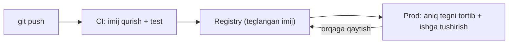

## Bu darsda nimalarni o‘rganamiz

- **Dev** va **prod** konteyner sozlamalarini toza ajratish.
- **CI**’da imij qurish va **registry**ga to‘g‘ri teg bilan jo‘natish.
- Dev→prod yetkazish quvuri.
- Yakuniy loyiha: Dockerlangan FastAPI + Postgres + Nginx stekini joylashtirish.

## Oldindan nima bilish kerak

Barcha oldingi Docker darslari. Bu dars ularni real yetkazish oqimiga bog‘laydi.

## Asosiy g‘oya — bir jumlada

> Dev **tez qayta aloqa** uchun (hot reload, jonli kod); prod **xavfsizlik va tezlik** uchun (o‘zgarmas imijlar, qattiqlashgan, testlangan) — bitta kodbaza, ikki sozlama.

**Hayotiy o‘xshatish — mashq va ochilish kechasi.** Mashq (dev) moslashuvchan: aktyorlar improvizatsiya qiladi, to‘xtatib qayta boshlaysiz, ssenariy jonli o‘zgaradi. Ochilish kechasi (prod) qulflangan: aynan mashq qilingan spektakl, improvizatsiyasiz, hammasi qattiqlashgan. Bir xil spektakl, ataylab boshqa sozlama.

## Dev va prod, yonma-yon

| | Dev | Prod |
|---|---|---|
| Kod | Bind mount (jonli tahrir) | Imijga qotirilgan (o‘zgarmas) |
| Server | `--reload` / dev server | Gunicorn/Uvicorn worker’lar |
| Imij | Semiz bo‘lsa ham mayli | Ko‘p bosqichli, slim, non-root |
| Sirlar | `.env` fayl | Sir boshqaruvi |
| Restart | Qo‘lda | `unless-stopped` + healthcheck |
| Maqsad | Tez qayta aloqa | Ishonchlilik va xavfsizlik |

## Compose override — bitta stek, ikki rejim

Compose bazaviy faylni override bilan birlashtiradi. `compose.yaml` umumiy ta’rifni; `compose.override.yaml` (avtomatik yuklanadi) dev qulayliklarini qo‘shadi:

```yaml
# compose.yaml  (baza — prod ko'rinishida)
services:
  web:
    build: .
    restart: unless-stopped
    environment:
      DATABASE_URL: postgresql://app:secret@db:5432/app
```

```yaml
# compose.override.yaml  (faqat dev — `docker compose up` avtomatik birlashtiradi)
services:
  web:
    volumes:
      - .:/app                 # jonli kod
    command: ["uvicorn", "app.main:app", "--reload", "--host", "0.0.0.0"]
```

```bash
docker compose up                                   # dev (baza + override)
docker compose -f compose.yaml up -d                # prod (faqat baza, override'siz)
```

## CI’da qurish va registry’ga jo‘natish

Prod imijlar **CI** tomonidan qurilishi, teglanishi va registry’ga jo‘natilishi kerak (Docker Hub, GHCR, ECR):

```bash
docker build -t registry.example.com/myapp:1.4.2 .   # semantik versiya tegi
docker build -t registry.example.com/myapp:$GIT_SHA .# commit tegi ham
docker push registry.example.com/myapp:1.4.2
```

Teglash qoidalari:
- **Deploy uchun `latest` ga tayanmang** — o‘zgarmas teg (versiya yoki commit SHA) qotiring, aniq nima ishlayotganini bilib, orqaga qayta olasiz.
- Kuzatuvchanlik uchun ham semantik versiya, ham git SHA bilan teglang.



## Yakuniy loyiha: real stekni joylashtirish

**FastAPI + Postgres + Nginx** ni butun kursni qo‘llab quring va joylashtiring:

- API uchun **ko‘p bosqichli, slim, non-root** imij.
- **Kesh-do‘st Dockerfile** va `.dockerignore`.
- Xizmatdan oldin migratsiya qiladigan **entrypoint**.
- **Compose**: API + Postgres (named volume, healthcheck) + Nginx (faqat ochiq port).
- **Healthcheck + restart siyosati + resurs limitlari**.
- Hot reload uchun **dev override**; o‘zgarmas ishga tushish uchun **prod baza**.
- SHA-teglangan imijni registry’ga jo‘natadigan **CI build**.

```yaml
# compose.yaml (yakuniy loyiha, prod ko'rinishida)
services:
  nginx:
    image: nginx:1.27-alpine
    ports: ["80:80"]
    volumes: ["./nginx.conf:/etc/nginx/conf.d/default.conf:ro", "static:/static:ro"]
    depends_on: [web]
    restart: unless-stopped
  web:
    image: ghcr.io/org/myapp:${TAG:-latest}
    expose: ["8000"]
    environment:
      DATABASE_URL: postgresql://app:secret@db:5432/app
    depends_on:
      db: { condition: service_healthy }
    restart: unless-stopped
    deploy: { resources: { limits: { cpus: "1", memory: 512M } } }
  db:
    image: postgres:16
    environment: { POSTGRES_USER: app, POSTGRES_PASSWORD: secret, POSTGRES_DB: app }
    volumes: ["pgdata:/var/lib/postgresql/data"]
    healthcheck: { test: ["CMD-SHELL", "pg_isready -U app"], interval: 5s, retries: 5 }
    restart: unless-stopped
volumes: { pgdata: {}, static: {} }
```

## Keng tarqalgan xatolar

1. **Dev va prod uchun bir xil sozlama** — yo prod’da hot-reload/dev server (xavfli), yo dev og‘riqli sekin.
2. **`latest` ni joylashtirish** — nima ishlayotganini bilib bo‘lmaydi, toza orqaga qaytish yo‘q.
3. **Prod xostida imij qurish** — CI’da quring; natijalarni jo‘nating.
4. **Bir muhit uchun sir/config qotirish** — env orqali parametrlang; bitta imij, ko‘p muhit.
5. **Orqaga qaytish rejasisiz** — oldingi teglarni saqlang; deploy = tegni tortish, rollback = eski tegni ishga tushirish.

## Xulosa

- Bitta kodbaza, ikki sozlama: dev tez aloqa uchun, prod o‘zgarmas xavfsizlik uchun — Compose override orqali.
- CI’da quring, versiya + SHA bilan teglang, registry’ga jo‘nating; `latest` ni joylashtirmang.
- Aniq tegni tortib deploy qiling; oldingisini ishga tushirib orqaga qayting.
- Yakuniy loyiha butun kursni real FastAPI + Postgres + Nginx joylashtirishga birlashtiradi.

## Mashqlar

**Oson**

1. Compose sozlamasini `compose.yaml` (prod ko‘rinishi) va `compose.override.yaml` (dev: mount + `--reload`) ga bo‘ling. Har birini ishga tushiring.
2. Imijni ham versiya, ham git SHA bilan teglang; nega `latest` dan afzalligini tushuntiring.

**O‘rtacha**

3. SHA-teglangan imijni quradigan va jo‘natadigan CI qadamini (GitHub Actions yoki shell skript) yozing.
4. Orqaga qaytishni ko‘rsating: A tegini deploy qiling, B tegini deploy qiling, keyin A ni qayta deploy qiling — ma’lumot volume orqali saqlanadi.

**Advanced**

5. Stekni uch muhit (dev/staging/prod) uchun env o‘zgaruvchilari va override fayllar bilan parametrlang, ilova kodini nol o‘zgartirmasdan.

**Xatoni top**

6. Prod tasodifan dev override’ni (hot-reload server) ishlatdi. Xavfni va baza/override ajratmasi buni qanday oldini olishini tushuntiring.

**Mini loyiha (yakuniy)**

To‘liq FastAPI + Postgres + Nginx stekini jo‘nating: ko‘p bosqichli non-root imij, kesh-do‘st Dockerfile, migratsiya entrypoint, healthcheckли named-volume baza, yagona ochiq portli Nginx, hot reload uchun dev override va SHA-teglangan imijni quradigan/jo‘natadigan CI. README’ga arxitektura diagrammasi, deploy va rollback buyruqlarini yozing.

## Test

<details>
<summary>1. Compose dev-only sozlamalarni qanday avtomatik qo‘llaydi?</summary>
<code>compose.override.yaml</code> `docker compose up` tomonidan avtomatik birlashtiriladi; prod’ni faqat <code>-f compose.yaml</code> bilan ishlating.
</details>

<details>
<summary>2. Nega `latest` o‘rniga versiya/SHA bilan teglaysiz?</summary>
O‘zgarmas, kuzatiladigan deploylar — aniq nima ishlayotganini bilib, muayyan tegga orqaga qaytasiz.
</details>

<details>
<summary>3. Prod imijlar qayerda qurilishi kerak?</summary>
CI’da, keyin registry’ga jo‘natiladi; prod xostlar aniq tegni tortadi.
</details>

<details>
<summary>4. O‘zgarmas imijlar bilan qanday orqaga qaytasiz?</summary>
Oldingi imij tegini ishga tushirасiz; holat volume/bazada yashaydi, shuning uchun bu shunchaki imij almashtirish.
</details>

## Tabriklaymiz!

Docker kursini tugatdingiz. Endi [AI yakuniy loyihangizni](/courses/ai-python/capstone-ai-assistant) shu stek bilan joylashtiring!
