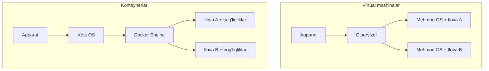
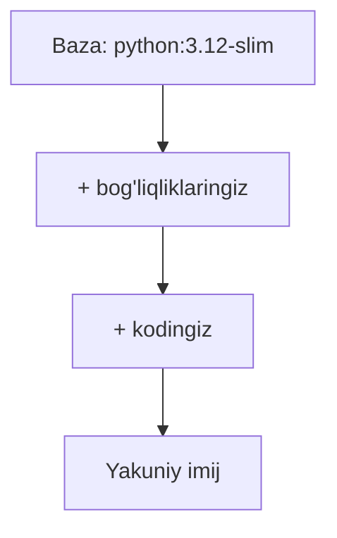

## Bu darsda nimalarni o‘rganamiz

- Konteyner nima va u virtual mashinadan qanday farq qiladi.
- **Imij** va **konteyner** farqini hamda **qatlamli** fayl tizimini.
- Asosiy CLI buyruqlari bilan konteynerlarni ishga tushirish, ko‘rish, to‘xtatish.
- Birinchi Python konteyneringizni ishga tushirish.

## Oldindan nima bilish kerak

Terminal buyruqlarini ishga tushira olish va Python asoslari. Docker o‘rnatilgan bo‘lishi kerak (Docker Desktop yoki Engine).

## Asosiy g‘oya — bir jumlada

> **Konteyner** — ilovangizni va u ishlashi uchun kerak bo‘lgan hamma narsani izolyatsiyalangan jarayonga qadoqlaydi, shunda u sizning noutbukingizda, hamkasbingizning mashinasida va serverda **bir xil** ishlaydi.

**Hayotiy o‘xshatish — yuk konteynerlari.** Standart konteynerlargacha yuklar bo‘lakma-bo‘lak ortilardi — sekin va bir kemada ishlagani boshqasida buzilardi. Standart yuk konteyneri qutini standartlashtirdi: har qanday kran, kema yoki yuk mashinasi uni bir xil ishlaydi. Docker buni dasturiy ta’minot uchun qiladi: ilovangiz + bog‘liqliklari standart qutiga joylashadi va Docker bor har qanday joyda bir xil ishlaydi. “Mening mashinamda ishlaydi” muammosi shu yerda tugaydi.

## Konteyner va virtual mashina



- **VM** apparatni virtuallashtiradi va har ilova uchun **to‘liq mehmon OS** ishlatadi — og‘ir (GB’lar, daqiqalar).
- **Konteyner** xost yadrosini bo‘lishadi va faqat jarayonni izolyatsiyalaydi — yengil (MB’lar, millisekundlar).

| | VM | Konteyner |
|---|---|---|
| Yuklanish | To‘liq OS (daqiqalar) | Jarayon (ms) |
| Hajmi | GB’lar | MB’lar |
| Izolyatsiya | Kuchli (o‘z yadrosi) | Jarayon darajasida (umumiy yadro) |
| Zichlik | Xostda kam | Xostda ko‘p |

Konteynerlar izolyatsiyaning ko‘p qismini juda kam narxda beradi — shuning uchun zamonaviy joylashtirish konteynerlarga asoslangan.

## Imij va konteyner

Bu farq har bir boshlovchini chalkashtiradi:

- **Imij** — faqat o‘qiladigan *shablon* — fayl tizimi + metadata snapshoti (klass yoki tort retseptiga o‘xshaydi).
- **Konteyner** — imijning ishlab turgan *nusxasi* (obyekt yoki haqiqiy tortga o‘xshaydi). Bitta imijdan ko‘p konteyner ishga tushirish mumkin.

```bash
docker pull python:3.12-slim     # imijni yuklab olish
docker run python:3.12-slim python -c "print('salom')"   # undan konteyner yaratib ishga tushirish
```

## Qatlamlar — fayl tizimi sirlari

Imijlar taxlanuvchi, keshlanuvchi **qatlamlar**dan quriladi. Har bir buyruq qatlam qo‘shadi; qatlamlar imijlar o‘rtasida bo‘lishiladi.



- Qatlamlar **keshlanadi va qayta ishlatiladi** — faqat kodingiz o‘zgarsa, Docker bog‘liqliklarni emas, o‘sha qatlamnigina qayta quradi.
- Qatlamlar **bo‘lishiladi** — bitta bazadagi o‘nta imij o‘sha bazani diskda bir marta saqlaydi.

## Asosiy CLI

```bash
docker run -d -p 8000:8000 --name web myimage   # fon rejimida, portni ulash
docker ps                     # ishlab turgan konteynerlar
docker ps -a                  # to'xtaganlarni ham
docker logs web               # chiqishini ko'rish
docker exec -it web bash      # ishlab turgan konteyner ichiga kirish
docker stop web && docker rm web   # to'xtatish va o'chirish
docker images                 # lokal imijlar
```

- `-d` fon rejimi, `-p xost:konteyner` portni ochadi, `--name` nom beradi.
- `docker exec -it ... bash` — konteynerga oynangiz, debug uchun ajralmas.

## Birinchi Python konteyneri

```bash
# Bir martalik konteynerda Python REPL
docker run -it --rm python:3.12-slim python

# Joriy papkadan bir martalik skript ishga tushirish
docker run --rm -v "$PWD:/app" -w /app python:3.12-slim python script.py
```

`--rm` konteyner tugaganda uni o‘chiradi; `-v` kodingizni ulaydi; `-w` ish papkasini belgilaydi. Python’ni xostingizga o‘rnatmasdan ishlatdingiz.

## Keng tarqalgan xatolar

1. **Imij va konteynerni chalkashtirish** — imijni `run` qilib konteyner olasiz; bitta imijdan ko‘p konteyner.
2. **`-p` ni unutish** — ilova ishlaydi, lekin xostdan unga yetib bo‘lmaydi.
3. **To‘xtagan konteyner/imijlarni qoldirish** — disk to‘ladi; `docker system prune` tozalaydi.
4. **Ma’lumot saqlanadi deb o‘ylash** — o‘chirilgan konteyner yozuv qatlamini yo‘qotadi (volume yechadi — keyingi dars).
5. **`docker run` o‘rniga `exec`** — `run` yangi konteyner ochadi; `exec` ishlab turganiga kiradi.

## Xulosa

- Konteyner ilova + bog‘liqliklarni yengil, ko‘chma, izolyatsiyalangan jarayonga joylaydi — dasturiy ta’minot uchun “yuk konteyneri”.
- Xost yadrosini bo‘lishadi (VM’dan farqli), shuning uchun tez va zich.
- Imij — shablon; konteyner — ishlab turgan nusxa; imijlar keshlanadigan, bo‘lishiladigan qatlamlardan quriladi.
- Asosiy CLI (`run`, `ps`, `logs`, `exec`, `stop`, `rm`) — kundalik vositangiz.

## Mashqlar

**Oson**

1. `python:3.12-slim` ni ishga tushiring, Python versiyasini chiqaring va `--rm` bilan o‘zini o‘chirsin.
2. `nginx` konteynerini `-p 8080:80` bilan fon rejimida ishga tushiring va brauzerda oching.

**O‘rtacha**

3. Fon konteynerini ishga tushiring, loglarini ko‘ring, `exec` bilan ichiga kiring, keyin to‘xtatib o‘chiring.
4. Barcha (to‘xtagan) konteynerlarni va lokal imijlarni ko‘ring; keyin to‘xtaganlarni tozalang.

**Fikrlash**

5. Qatlamlar orqali tushuntiring: nega bitta qator kodni o‘zgartirgach qayta qurish tez, lekin baza imijni o‘zgartirish sekin?

**Xatoni top**

6. Hamkasbingiz “konteyner ishlayapti, lekin sayt ochilmayapti” deydi. U `docker run -d myimage` ni `-p` siz ishlatgan. Sababi va yechimi?

**Mini loyiha**

Faqat CLI bilan (hali Dockerfile’siz): Python konteynerini ishga tushiring, `-v` bilan lokal skriptni ulang, uni ishga tushiring, keyin interaktiv sessiya ochib ichida paket o‘rnating — konteyner o‘chirilganda o‘zgarish yo‘qolishini kuzating. Nima saqlanib qoldi va nima yo‘qoldi — yozib chiqing.

## Test

<details>
<summary>1. Konteynerlar to‘liq mehmon OS’ni o‘z ichiga oladimi?</summary>
Yo‘q — ular xost yadrosini bo‘lishadi va faqat jarayonni izolyatsiyalaydi (VM’dan farqli).
</details>

<details>
<summary>2. Imij va konteyner farqi?</summary>
Imij — faqat o‘qiladigan shablon; konteyner — undan yaratilgan ishlab turgan nusxa.
</details>

<details>
<summary>3. Nega Docker qurishlari ko‘pincha tez?</summary>
Qatlamlar keshlanadi va qayta ishlatiladi — o‘zgarmagan qatlamlar (masalan o‘rnatilgan bog‘liqliklar) qayta qurilmaydi.
</details>

<details>
<summary>4. Ishlab turgan konteyner ichiga qanday kirasiz?</summary>
<code>docker exec -it &lt;nom&gt; bash</code> (yoki <code>sh</code>).
</details>

## Keyingi dars

[Imijlar va Dockerfile](/courses/docker-python/images-and-dockerfile) — o‘z imijingizni quramiz.
