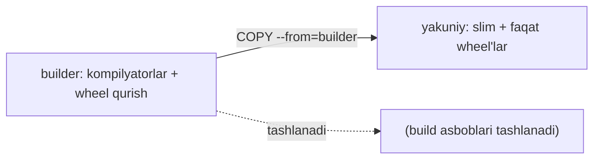

## Bu darsda nimalarni o‘rganamiz

- **Ko‘p bosqichli build** bilan imijni keskin kichraytirish.
- Qatlamlarni tartiblash va BuildKit kesh mount’lari.
- Python imijini aslida nima shishirishini va uni qanday trimlashni.
- Imij hajmi va build vaqtini o‘lchash.

## Oldindan nima bilish kerak

[Imijlar va Dockerfile](/courses/docker-python/images-and-dockerfile).

## Asosiy g‘oya — bir jumlada

> **Ko‘p bosqichli build** kompilyatsiya/o‘rnatish uchun og‘ir “builder” imij ishlatadi, so‘ng faqat tayyor natijalarni kichkina yakuniy imijga ko‘chiradi — tortni jo‘natasiz, butun oshxonani emas.

**Hayotiy o‘xshatish — pishirish va tortqa qo‘yish.** Taomni *tayyorlash* uchun asboblar va xom masalliqlar to‘la iflos oshxona kerak (builder bosqichi). Lekin mijozga oshxonani bermaysiz — tayyor taomni toza likobga qo‘yasiz (yakuniy bosqich). Ko‘p bosqichli build oshxonani tashlab, faqat likobni jo‘natadi.

## Muammo: build asboblari imijni shishiradi

Ko‘p Python paketini o‘rnatish kompilyatorlar va sarlavhalar (`gcc`) talab qiladi, lekin ilovangizga *ishga tushishda* ular kerak emas — bir bosqichli imijda ular qoladi va yuzlab MB qo‘shadi.

## Ko‘p bosqichli yechim

```dockerfile
# ---- 1-bosqich: builder (kompilyatorli) ----
FROM python:3.12-slim AS builder
WORKDIR /app
RUN pip install --no-cache-dir --upgrade pip
COPY requirements.txt .
RUN pip wheel --no-cache-dir --wheel-dir /wheels -r requirements.txt

# ---- 2-bosqich: yakuniy (slim, build asboblarsiz) ----
FROM python:3.12-slim
WORKDIR /app
COPY --from=builder /wheels /wheels                 # faqat qurilgan wheel'larni ko'chirish
RUN pip install --no-cache-dir /wheels/*            # wheel'lardan o'rnatish, kompilyatorsiz
COPY . .
EXPOSE 8000
CMD ["gunicorn", "app.main:app", "-k", "uvicorn.workers.UvicornWorker", "-b", "0.0.0.0:8000"]
```

Yakuniy imijda ilovangiz + o‘rnatilgan paketlar bor, lekin build asboblarining **hech biri** yo‘q.



## BuildKit kesh mount’lari

Zamonaviy Docker (BuildKit) pip kesh’ini imijga qo‘shmasdan buildlar orasida keshlashi mumkin:

```dockerfile
# syntax=docker/dockerfile:1
RUN --mount=type=cache,target=/root/.cache/pip \
    pip install -r requirements.txt
```

Kesh buildlar orasida saqlanadi (tezroq), lekin imijda saqlanmaydi (kichikroq). Ikkalasidan eng yaxshisi.

## Nimalar imijni shishiradi — va yechimlar

| Shish | Yechim |
|---|---|
| Build asboblari (`gcc`, sarlavhalar) | Ko‘p bosqichli; ularni faqat builder’da qoldiring |
| pip yuklab olish keshi | `--no-cache-dir` va/yoki BuildKit kesh mount |
| Semiz baza imij | `-slim` (yoki distroless) |
| `.git`, venv, `__pycache__` | `.dockerignore` |
| Hamma narsani ko‘chirib keyin o‘chirish | Qo‘shilmagan = kichikroq; o‘chirish oldingi qatlamlarni kichraytirmaydi |

> [!WARNING]
> Keyingi qatlamda fayl o‘chirish oldingi qatlamlarni kichraytirmaydi — baytlar imij tarixida qoladi. Buning o‘rniga umuman qo‘shmang (ko‘p bosqichli, `.dockerignore`), qo‘shib-`rm` qilmang.

## O‘lchash — ma’lumot bilan optimizatsiya

```bash
docker images myapp             # hajmni ko'rish
docker history myapp            # qatlam bo'yicha hajmlar — shishni topish
```

`docker history` qaysi qatlam katta ekanini ko‘rsatadi — *o‘shani* optimallashtiring. Taxmin qilish kuchni behuda sarflaydi; har o‘zgarishdan oldin va keyin o‘lchang.

## Keng tarqalgan xatolar

1. **Build asboblarli bir bosqichli** — yuzlab isrof MB.
2. **“Tozalash” uchun qo‘shib-`rm`** — oldingi qatlamlarda baytlar qoladi.
3. **Hajm uchun alpine, keyin musl kurashi** — slim + ko‘p bosqichli odatda kichikroq va silliqroq.
4. **`.dockerignore` yo‘qligi** — kontekst shishishi va tasodifiy sirlar.
5. **Kam quriladigan imijni ortiqcha optimallash** — kuchni foyda beradigan joyга sarflang.

## Xulosa

- Ko‘p bosqichli build natijalarni jo‘natadi, build asboblarini emas — keskin kichik imij.
- Qatlam tartibini kesh-do‘st tuting; tez, engil build uchun BuildKit kesh mount’lari.
- Shish build asboblari, kesh, semiz baza va begona fayllardan keladi — oldini oling, o‘chirmang.
- `docker history` bilan o‘lchang; aslida katta qatlamni optimallashtiring.

## Mashqlar

**Oson**

1. Bir bosqichli Dockerfile’ni ikki bosqichga (builder + yakuniy) o‘tkazing; `docker images` hajmlarini solishtiring.
2. Imijda `docker history` ishlatib, eng katta qatlamni aniqlang.

**O‘rtacha**

3. `.dockerignore` qo‘shing va build konteksti hamda imij hajmini qayta o‘lchang.
4. BuildKit pip kesh mount qo‘shing va qayta qurishni usiz bilan solishtiring.

**Advanced**

5. `gcc` bilan kompilyatsiya talab qiladigan ilova oling; ko‘p bosqichli va wheel’lar bilan yakuniy imijni 250 MB dan kichik qiling. Oldin/keyin hajmlarini hujjatlang.

**Xatoni top**

6. Kimdir bir xil Dockerfile’da 300 MB datasetni qo‘shib keyin `rm` qilib “tozalagan”, lekin imij hali ham katta. Nega va qanday aslida tuzatiladi?

**Mini loyiha**

Real ilova imijini uchma-uch optimallashtiring: sodda bir bosqichlidan boshlab, ko‘p bosqichli, slim baza, `.dockerignore`, `--no-cache-dir` va BuildKit kesh qo‘llang. Har qadamda hajm va build vaqti jadvalini chiqaring.

## Test

<details>
<summary>1. Ko‘p bosqichli build yakuniy imijdan nimani chetlatishga imkon beradi?</summary>
Build asboblar zanjirini (kompilyatorlar, sarlavhalar, keshlar) — faqat tayyor natijalar ko‘chiriladi.
</details>

<details>
<summary>2. Keyingi qatlamda faylni `rm` qilish imijni kichraytiradimi?</summary>
Yo‘q — oldingi qatlamlar hali ham baytlarni saqlaydi. Umuman qo‘shmang.
</details>

<details>
<summary>3. Qatlam bo‘yicha hajmlarni qanday ko‘rasiz?</summary>
<code>docker history &lt;imij&gt;</code>.
</details>

<details>
<summary>4. Nega kichik imij xavfsizroq ham?</summary>
Kam o‘rnatilgan paket = kam ma’lum zaifliklar (kichik hujum yuzasi).
</details>

## Keyingi dars

[Xavfsizlik va Eng Yaxshi Amaliyotlar](/courses/docker-python/security-and-best-practices).
