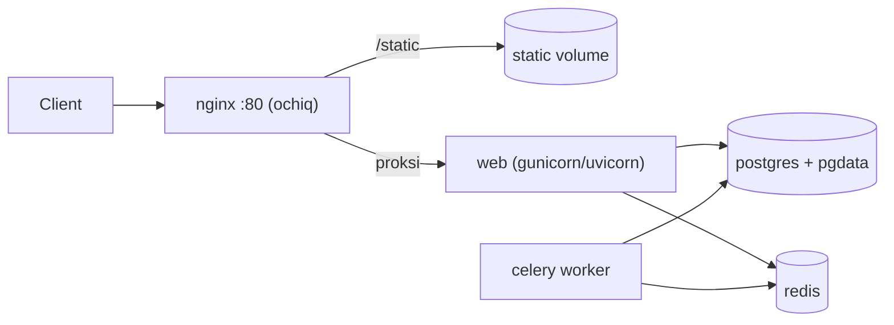

## Bu darsda nimalarni o‘rganamiz

- **PostgreSQL** ni Docker’da doimiylik va sog‘lik bilan ishlatish.
- Keshlash va Celery broker sifatida **Redis** qo‘shish.
- Oldida teskari proksi sifatida **Nginx** qo‘yish (static va TLS).
- Real ko‘p-servisli stekni yig‘ish.

## Oldindan nima bilish kerak

[FastAPI/Django’ni Konteynerlash](/courses/docker-python/dockerizing-fastapi-django) va [Docker Compose](/courses/docker-python/docker-compose).

## Asosiy g‘oya — bir jumlada

> Real ilovalar — **konteynerlar jamoasi**: ilovangiz, ma’lumotlar bazasi (Postgres), kesh/broker (Redis) va teskari proksi (Nginx) — har biri bitta ish qiladi, Compose ular orasini ulaydi.

**Hayotiy o‘xshatish — restoran bo‘limlari.** Ilovangiz — oshpaz. Postgres — omborxona (hamma narsani doimiy saqlaydi). Redis — tayyor mahsulotlar peshtaxtasi (tez, vaqtinchalik — yo‘qolsa qayta hisoblanadi). Nginx — eshikdagi mezbon: mehmonlarni kutib olib (mijozlar), menyu berib (static fayllar) va trafikni oshxonaga yo‘naltiradi. Har bo‘lim ixtisoslashadi; restoran ular muvofiqlashgani uchun ishlaydi.

## PostgreSQL — doimiy saqlash

```yaml
  db:
    image: postgres:16
    environment:
      POSTGRES_USER: app
      POSTGRES_PASSWORD: secret          # real hayotda sir/.env ishlating
      POSTGRES_DB: app
    volumes:
      - pgdata:/var/lib/postgresql/data  # ← doimiylik (named volume)
    healthcheck:
      test: ["CMD-SHELL", "pg_isready -U app"]
      interval: 5s
      retries: 5
    # ports: yo'q — bazani xostga ochmang, ichki qoldiring
```

**Named volume** — muzokarasiz: usiz har `docker compose down` bazangizni o‘chiradi. Bazani xost tarmog‘idan tashqarida (portlarsiz) qoldiring; unga faqat ilova kerak.

## Redis — kesh va broker

Redis — xotiradagi ombor: juda tez, lekin ma’lumot vaqtinchalik. Ikki keng tarqalgan rol:

```yaml
  redis:
    image: redis:7-alpine
    command: ["redis-server", "--appendonly", "yes"]   # ixtiyoriy doimiylik
    volumes:
      - redisdata:/data
```

- **Kesh** — hisoblangan natijalarni saqlab qayta hisoblashdan qochish (`redis://redis:6379/0`).
- **Broker** — Celery/RQ uchun fon vazifalari navbatini saqlash.

Kesh bo‘lgani uchun Redis ma’lumotini **yo‘qotilishi mumkin** deb hisoblang: Redis bo‘sh bo‘lsa ham ilovangiz (sekinroq) ishlashi kerak.

## Celery worker (fon vazifalari)

```yaml
  worker:
    build: .
    command: ["celery", "-A", "myproject", "worker", "-l", "info"]
    environment:
      CELERY_BROKER_URL: redis://redis:6379/0
    depends_on: [redis, db]
```

**Bir xil imij** boshqa jarayon (web o‘rniga worker) sifatida ishlaydi — bitta build, ko‘p rol. Bu — idiomatik Compose naqshi.

## Nginx — teskari proksi

Nginx ilovangiz oldida turadi: static fayllarni samarali xizmat qiladi, TLS’ni tugatadi, sekin mijozlarni buferlaydi va yukni taqsimlaydi.

```nginx
# nginx.conf
upstream app { server web:8000; }        # 'web' = ilova servis nomi
server {
    listen 80;
    location /static/ { alias /static/; }  # static fayllarni to'g'ridan-to'g'ri (tez)
    location / {
        proxy_pass http://app;             # qolgan hammasi → ilova
        proxy_set_header Host $host;
        proxy_set_header X-Forwarded-For $proxy_add_x_forwarded_for;
    }
}
```

```yaml
  nginx:
    image: nginx:1.27-alpine
    ports: ["80:80"]                       # ← YAGONA ochiq port
    volumes:
      - ./nginx.conf:/etc/nginx/conf.d/default.conf:ro
      - static:/static:ro
    depends_on: [web]
```

## To‘liq manzara



Faqat Nginx port ochadi; qolgan hammasi ichki tarmoqda nom orqali gaplashadi. Bu — ishlab chiqarishga mos topologiya.

## Keng tarqalgan xatolar

1. **Postgres’da volume yo‘qligi** — `down` da ma’lumot yo‘qoladi.
2. **db/redis portlarini xostga ochish** — keraksiz ochiqlik; ichki qoldiring.
3. **Ilova static fayllarni xizmat qilishi** — sekin va isrof; `/static` ni Nginx bersin.
4. **Redis doimiy deb o‘ylash** — kesh yo‘qolishiga tayyor bo‘ling.
5. **Nomlarni IP sifatida qotirish** — servis nomlaridan (`db`, `redis`, `web`) foydalaning.

## Xulosa

- Real stek — ilova + Postgres (doimiy, volume) + Redis (kesh/broker, vaqtinchalik) + Nginx (ochiq proksi).
- Bazani named volume bilan saqlang; uni va Redis’ni ichki qoldiring.
- Nginx static fayllarni xizmat qiladi va qolganini proksi qiladi; u yagona ochiq port.
- Web va worker rollari uchun bitta imijni qayta ishlating.

## Mashqlar

**Oson**

1. Named volume va healthcheckли Postgres servisi qo‘shing; ilovangizni nom orqali ulang.
2. Redis qo‘shing va ilovangizda hisoblangan qiymatni keshlab, keyingi so‘rovda o‘qing.

**O‘rtacha**

3. Ilovaga proksi qiladigan va umumiy volume’dan `/static/` beradigan Nginx servisi qo‘shing.
4. Web bilan bir xil imijni, boshqa `command` bilan ishlatuvchi Celery worker qo‘shing.

**Advanced**

5. To‘liq ilova + db + redis + worker + nginx stekini yig‘ing; faqat 80-portni oching; ichki-only db/redis va uchma-uch so‘rov oqimini tekshiring.

**Xatoni top**

6. Static fayllar Nginx orqali 404 beradi, lekin ilova ishlaydi. `location /static/` alias va volume mount’ni ko‘rib, noto‘g‘ri sozlamani toping.

**Mini loyiha**

Ishlab chiqarishga mos Compose stek quring: Django/FastAPI + Postgres (volume, healthcheck) + Redis (kesh + Celery broker) + Celery worker + Nginx (static + proksi, yagona ochiq port). Keshdan foydalanadigan sahifani va fon vazifasini yuklang; topologiyani diagramma bilan hujjatlang.

## Test

<details>
<summary>1. Nega Postgres’da named volume bo‘lishi shart?</summary>
Aks holda ma’lumot konteynerning yozuv qatlamida yashaydi va o‘chirishda/`down` da yo‘qoladi.
</details>

<details>
<summary>2. Redis’ni doimiy saqlash sifatida ko‘rish kerakmi?</summary>
Yo‘q — u kesh/broker; Redis ma’lumoti yo‘qolsa ham ilova (sekinroq) ishlashiga moslashtiring.
</details>

<details>
<summary>3. Qaysi servis yagona xost portini ochadi?</summary>
Nginx (teskari proksi); db, redis va ilova ichki tarmoqda qoladi.
</details>

<details>
<summary>4. Celery worker web ilova kodini qanday qayta ishlatadi?</summary>
Bir xil imijni boshqa <code>command</code> (celery worker) bilan ishlatadi — bitta build, ko‘p rol.
</details>

## Keyingi dars

[Ko‘p Bosqichli Build va Optimizatsiya](/courses/docker-python/multi-stage-and-optimization).
