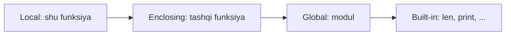

## Bu darsda nimalarni o‘rganamiz

- Pozitsion, kalitli, standart, `*args` va `**kwargs` parametrlarni o‘zlashtirish.
- **O‘zgaruvchan standart argument** tuzog‘idan qochish.
- Argumentlarni **unpacking** bilan uzatish va yig‘ish.
- Python nomlarni **LEGB** bo‘yicha qanday hal qilishini.

## Oldindan nima bilish kerak

Siz allaqachon oddiy funksiya yozib, ro‘yxat/lug‘at ishlata olasiz. Bu dars “funksiya yoza olaman” ni “argumentlar va scope aynan qanday ishlashini tushunaman” ga aylantiradi.

## Asosiy g‘oya — bir jumlada

> Funksiya chaqiruvi — Python **uzatgan argumentlaringizni aniqlagan parametrlarga moslashtirishi**, so‘ng tanani yangi lokal nom fazosida ishlatishi.

**Hayotiy o‘xshatish — qahva buyurtmasi.** Parametrlar — buyurtma blankasidagi maydonlar (hajm, sut, qo‘shimcha shot). Pozitsion argumentlar — ularni yuqoridan pastga to‘ldirish; kalitli argumentlar — maydon nomini aniq yozish (“sut: yulaf”). Standart qiymatlar — siz ko‘rsatmasangiz barista taxminlari. `*args`/`**kwargs` — “va yana xohlagan narsangiz”.

## Parametr asboblari

```python
def order(size, milk="whole", *extras, sugar=0, **notes):
    ...
```

- `size` — pozitsion-yoki-kalitli, majburiy.
- `milk="whole"` — **standart** qiymatли, ixtiyoriy.
- `*extras` — **qo‘shimcha pozitsion** argumentlarni tuple’ga yig‘adi.
- `sugar=0` — `*extras` dan keyin **faqat-kalitli** (nom bilan berilishi shart).
- `**notes` — **qo‘shimcha kalitli** argumentlarni lug‘atga yig‘adi.

```python
order("large", "oat", "cinnamon", sugar=2, decaf=True)
# size="large", milk="oat", extras=("cinnamon",), sugar=2, notes={"decaf": True}
```

### Pozitsion-only va keyword-only belgilari

```python
def f(a, b, /, c, *, d):   #  / = undan oldingilar faqat-pozitsion;  * = keyingilar faqat-kalitli
    ...
f(1, 2, 3, d=4)
```

`/` va `*` toza, kelajakka chidamli imzo tuzishga imkon beradi.

## O‘zgaruvchan standart argument tuzog‘i

```python
def add_item(item, basket=[]):     # ⚠️ standart ro'yxat BIR MARTA, def vaqtida yaratiladi
    basket.append(item)
    return basket

add_item("a")     # ['a']
add_item("b")     # ['a', 'b']  ← kutilmagan! bir xil ro'yxat qayta ishlatildi
```

Standart qiymat **bir marta** — funksiya aniqlanganda baholanadi, har chaqiruvда emas. Yechim — Python idiomasi:

```python
def add_item(item, basket=None):
    if basket is None:
        basket = []            # har chaqiruvda yangi ro'yxat
    basket.append(item)
    return basket
```

> [!WARNING]
> Bu — eng ko‘p uchraydigan intervyu savoli *va* real xato. Hech qachon `[]`, `{}` yoki boshqa o‘zgaruvchan obyektni standart sifatida ishlatmang. `None` ishlating va ichida yarating.

## Argumentlarni unpacking

`*` va `**` chaqiruv joyida ham iterable/lug‘atni argumentlarga yoyadi:

```python
def point(x, y, z): ...
coords = (1, 2, 3)
point(*coords)                 # → point(1, 2, 3)

opts = {"x": 1, "y": 2, "z": 3}
point(**opts)                  # → point(x=1, y=2, z=3)
```

Wrapper va dekoratorlar aynan shunday argumentlarni uzatadi: `def wrapper(*args, **kwargs): return fn(*args, **kwargs)`.

## Scope: LEGB

Nom ishlatilganda Python quyidagi tartibda qidiradi:



```python
x = "global"
def outer():
    x = "enclosing"
    def inner():
        print(x)      # o'qishda 'enclosing' topiladi (E)
    inner()
```

- Nomga qiymat berish uni standart holatda **lokal** qiladi — hatto o‘sha nomli global bo‘lsa ham.
- Modul darajasidagi nomni qayta bog‘lash uchun `global`, tashqi nom uchun `nonlocal` (ikkalasi ham kamdan-kam va odatda “hid”).

```python
count = 0
def bump():
    global count       # busiz `count += 1` UnboundLocalError beradi
    count += 1
```

## Keng tarqalgan xatolar

1. **O‘zgaruvchan standartlar** — chaqiruvlar orasida umumiy holat.
2. **`UnboundLocalError`** — tashqi scope’dan o‘qigan nomga `global`/`nonlocal`siz qiymat berish.
3. **Opsiyalarni pozitsion uzatish** — imzo o‘zgarsa mo‘rt; opsiyalar uchun kalitli argument.
4. **`**kwargs` ni ortiqcha ishlatish** — haqiqiy interfeysni yashiradi; imkon qadar aniq bo‘ling.

## Xulosa

- Parametrlar: pozitsion-yoki-kalitli, standart, `*args`, faqat-kalitli, `**kwargs`; `/` va `*` shartnomani shakllantiradi.
- O‘zgaruvchan standartlarni hech qachon ishlatmang — `None` va ichida yaratish.
- `*`/`**` chaqiruv joyida yoyadi, generik wrapper’larni quvvatlaydi.
- Nomlar LEGB bo‘yicha hal bo‘ladi; qiymat berish nomni lokal qiladi, `global`/`nonlocal` e’lon qilmasangiz.

## Mashqlar

**Oson**

1. `greet(name, greeting="Hello", *, punctuation="!")` yozing va uni uch xil chaqiring.
2. Standart sifatida `data={}` ishlatuvchi funksiyani tuzating — har chaqiruv yangi boshlansin.

**O‘rtacha**

3. Istalgancha kalitli argument qabul qilib, ularni kalit bo‘yicha tartiblab qaytaradigan funksiya yozing.
4. `call_with(fn, args, kwargs)` yozing — `fn(*args, **kwargs)` ni chaqirsin; `print` da sinang.

**Advanced**

5. Pozitsion suiiste’moldan man qiladigan `configure(*, timeout, retries, backoff=2)` imzosini tuzing va nega faqat-kalitli to‘g‘riligini tushuntiring.

**Xatoni top**

6. Tushuntiring va tuzating:
```python
def counter(n, seen=set()):
    seen.add(n); return len(seen)
```

**Mini loyiha**

Kichik `dispatch` yordamchisi: nom bo‘yicha handler funksiyalarini ro‘yxatga oling, so‘ng `dispatch("name", *args, **kwargs)` mos handlerga argumentlarni uzatsin. Noma’lum nomni chиройli boshqaring.

## Test

<details>
<summary>1. Standart argument qiymati qachon yaratiladi?</summary>
Bir marta — funksiya aniqlanganda, har chaqiruvda emas. Shuning uchun o‘zgaruvchan standartlar umumiy bo‘ladi.
</details>

<details>
<summary>2. `**kwargs` nimani yig‘adi?</summary>
Qo‘shimcha kalitli argumentlarni lug‘atga.
</details>

<details>
<summary>3. Nega o‘zgaruvchini o‘qish UnboundLocalError berishi mumkin?</summary>
Chunki siz unga funksiyada qiymat ham berasiz — u lokal bo‘ladi; o‘qish qiymat berishdan oldin sodir bo‘ladi. Tashqi nomni qayta bog‘lash uchun `global`/`nonlocal`.
</details>

<details>
<summary>4. `f(*seq)` nima qiladi?</summary>
`seq` ni chaqiruv joyida pozitsion argumentlarga yoyadi.
</details>

## Keyingi dars

[Closure va dekoratorlar](/courses/python-foundations/closures-and-decorators).
