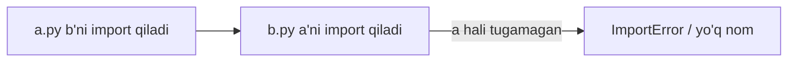

## Bu darsda nimalarni o‘rganamiz

- `import` aslida nima qilishini va Python modullarni qanday topishini.
- `__init__.py` bilan **paket** tuzish va toza importlar.
- Absolyut va nisbiy importlar hamda **aylanma import**lardan qochish.
- `__name__ == "__main__"` va modul darajasidagi bajarilish.

## Oldindan nima bilish kerak

[Funksiyalar va scope](/courses/python-foundations/functions-arguments-scope). Skriptlar yozgansiz; endi ularni real loyihalarga tashkil qilamiz.

## Asosiy g‘oya — bir jumlada

> **Modul** — `.py` fayl; **paket** — modullar papkasi. `import` **modulni bir marta ishga tushiradi**, keshlaydi va nomlarni sizning nom fazongizga bog‘laydi.

**Hayotiy o‘xshatish — kutubxona va kitoblari.** Modul — kitob; paket — bog‘liq kitoblar javoni; loyihangiz — butun kutubxona. `import` — kitobni olish: birinchi so‘ragan uni javondan olib boshdan-oyoq o‘qiydi (modul yuqoridan pastga bir marta ishlaydi); keyingilar allaqachon o‘qilgan nusxani (kesh) darrov oladi.

## `import` aslida nima qiladi

```python
import math          # 1) math ni top  2) bir marta ishga tushir  3) `math` nomini bog'la
math.sqrt(9)

from math import sqrt      # faqat `sqrt` ni bog'la
from math import pi as PI  # yangi nom bilan bog'la
```

Birinchi importda Python:
1. `sys.path` (joriy papka, o‘rnatilgan paketlar, stdlib) da modulni qidiradi,
2. **modulni yuqoridan pastga bajaradi** (top-level kod ishlaydi),
3. natijani `sys.modules` ga saqlaydi — keyingi importlar kesh — **modul tanasi jarayonда bir marta ishlaydi.**

## Paketlar va `__init__.py`

```
myapp/
├── __init__.py         # myapp ni paket sifatida belgilaydi
├── models.py
├── services/
│   ├── __init__.py
│   └── email.py
└── main.py
```

```python
from myapp.models import User            # absolyut import (afzal)
from myapp.services.email import send
```

`__init__.py` paket birinchi import qilinganда ishlaydi. Uni yengil tuting — ko‘pincha toza ommaviy API’ni qayta eksport qiladi:

```python
# myapp/__init__.py
from .models import User
from .services.email import send
__all__ = ["User", "send"]    # `from myapp import *` nimani ochadi
```

## Absolyut va nisbiy importlar

```python
# myapp/services/email.py ichida
from myapp.models import User     # absolyut — aniq, har joydan ishlaydi
from ..models import User         # nisbiy — . = joriy paket, .. = ota
```

**Absolyut import**larni afzal ko‘ring; nisbiyni faqat paket ichidagi zich havolalar uchun.

## `__name__ == "__main__"`

Har modulning `__name__` bor. Import qilinganда — modul nomi; to‘g‘ridan-to‘g‘ri ishga tushirilganda (`python main.py`) — `"__main__"`:

```python
def main():
    print("ishlayapti")

if __name__ == "__main__":
    main()        # faqat to'g'ridan-to'g'ri ishga tushirilganda, import qilinganда emas
```

Bu faylni **ham** import qilinadigan modul, **ham** ishga tushiriladigan skript qiladi.

## Aylanma importlar

`a.py` `b` ni, `b.py` `a` ni import qilsa, ikkinchi import yarim-initsializatsiyalangan modulga tegadi:



Yechimlar (afzallik tartibida):
1. **Qayta tuzing** — umumiy qismni ikkalasi import qiladigan uchinchi modulga ko‘chiring.
2. **Funksiya ichida import qiling** (kechiktirilgan import), modul yuqorisida emas.
3. **Nomni emas, modulni import qiling** (`import a`, keyin `a.thing`).

## Keng tarqalgan xatolar

1. **`from module import *`** — nom fazosini ifloslaydi; aniq nomlarni import qiling.
2. **Modul yuqorisida og‘ir ish** — importда ishlaydi, ishga tushirishни sekinlashtiradi.
3. **Aylanma importlar** — qayta tuzing.
4. **To‘g‘ridan-to‘g‘ri ishlatilgan skriptda nisbiy import** — muvaffaqiyatsiz; `python -m pkg.script` yoki absolyut.
5. **stdlib ustiga soya** — faylni `random.py` deb nomlash importni buzadi.

## Xulosa

- Modullar fayllar, paketlar `__init__.py` bilan papkalar; `import` modulni bir marta ishlatib keshlaydi.
- Absolyut importlarni afzal ko‘ring; `__all__` bilan toza ommaviy API belgilang.
- `__name__ == "__main__"` faylni ham import, ham ishga tushiriladigan qiladi.
- Aylanma importlarni qayta tuzish yoki kechiktirish bilan sindiring.

## Mashqlar

**Oson**

1. `circle.py` va `square.py` bilan `shapes/` paketini yarating va ikkalasini `main.py` dan import qiling.
2. Faqat to‘g‘ridan-to‘g‘ri ishga tushirilganda demo ishlaydigan `if __name__ == "__main__":` bloki qo‘shing.

**O‘rtacha**

3. `__init__.py` va `__all__` bilan paketingizga toza ommaviy API oching.
4. Ikki modul orasida aylanma importni takrorlang, keyin umumiy kodni uchinchi modulga ko‘chirib tuzating.

**Advanced**

5. Modul yuqorisiga print qo‘shib, uni ikki joydan import qilib, top-level kod bir marta ishlashini ko‘rsating.

**Xatoni top**

6. Kimdir `import email` (stdlib) bilan bir qatorda faylni `email.py` deb nomlagan. Muvaffaqiyatsizlikni va yechimni tushuntiring.

**Mini loyiha**

Bitta 300 qatorli skriptni to‘g‘ri paketga aylantiring: `cli.py` kirish nuqtasi, fokuslangan modulli `core/` paketi, absolyut importlar, toza `__init__.py` va `python -m yourpkg` ishga tushirish nuqtasi.

## Test

<details>
<summary>1. Modul top-level kodi jarayonда necha marta ishlaydi?</summary>
Bir marta — keyingi importlar `sys.modules` keshidan xizmat qilinadi.
</details>

<details>
<summary>2. Qaysi import uslubi afzal va nega?</summary>
Absolyut importlar — to‘liq yo‘lni aniq bildiradi va fayl qayerda ishlatilishidan qat’i nazar ishlaydi.
</details>

<details>
<summary>3. `__all__` nima?</summary>
`from package import *` eksport qiladigan ommaviy nomlarni belgilaydigan ro‘yxat.
</details>

<details>
<summary>4. Aylanma importni sindirishning bir usulini ayting.</summary>
Umumiy kodni uchinchi modulga ko‘chiring yoki importni uni ishlatadigan funksiyaga kechiktiring.
</details>

## Keyingi dars

[Xatoliklarni to‘g‘ri boshqarish](/courses/python-foundations/error-handling).
